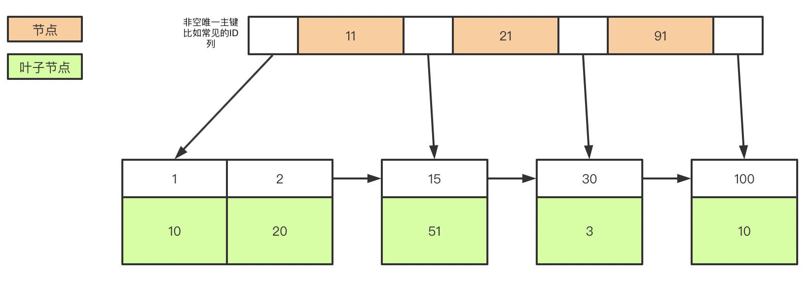
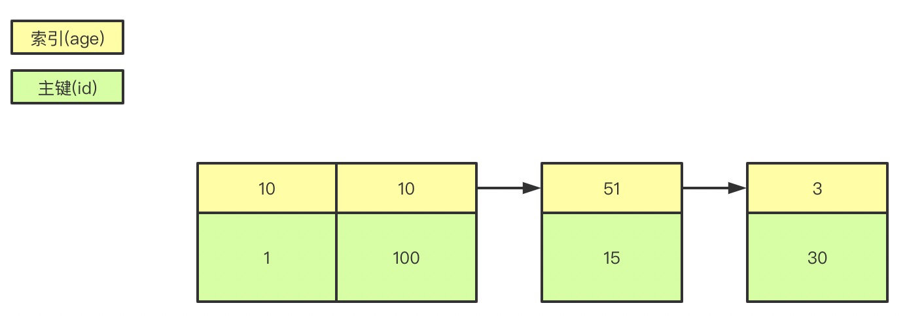
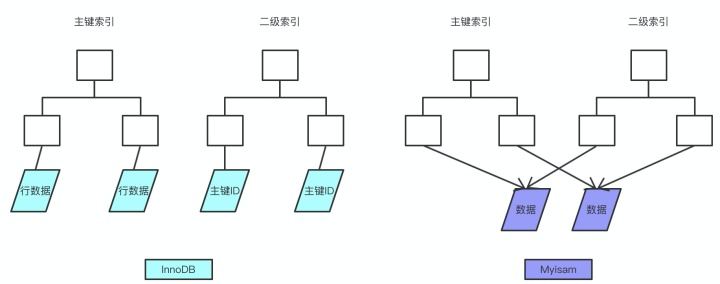
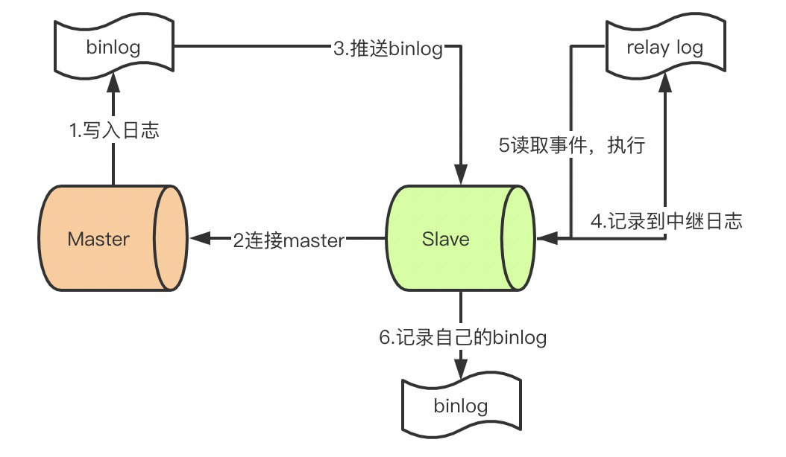

- [引擎](#引擎)
  - [***myisam*** 和 ***innodb*** 的区别](#myisam-和-innodb-的区别)
  - [mysql的索引有哪些，聚簇和非聚簇索引又是什么](#mysql的索引有哪些聚簇和非聚簇索引又是什么)
  - [覆盖索引和回表](#覆盖索引和回表)
  - [in 使用索引](#in-使用索引)
  - [索引失效](#索引失效)
- [锁](#锁)
  - [常见的锁](#常见的锁)
  - [什么是死锁？怎么解决？](#什么是死锁怎么解决)
- [事务](#事务)
  - [事务基本特性](#事务基本特性)
    - [ACID](#acid)
    - [隔离级别](#隔离级别)
    - [怎么保证ACID](#怎么保证acid)
    - [什么是幻读 什么是mvcc](#什么是幻读-什么是mvcc)
    - [分库分表](#分库分表)
    - [分表后的id唯一性](#分表后的id唯一性)
    - [主从同步](#主从同步)
- [索引补充](#索引补充)
  - [MyISAM 和 Innodb的不同点](#myisam-和-innodb的不同点)
  - [Undo log Redo log 和 Binary log](#undo-log-redo-log-和-binary-log)
    - [Undo log](#undo-log)
    - [Redo log](#redo-log)
    - [Bin log](#bin-log)
- [Mybatis](#mybatis)
  - [延迟加载](#延迟加载)
  - [一二级缓存](#一二级缓存)
  
## 引擎

### ***myisam*** 和 ***innodb*** 的区别

myisam引擎是5.1版本之前的默认引擎，支持全文检索、压缩、空间函数等，但是**不支持**事务和行级锁，所以一般用于大量查询少量插入的场景来使用，而且myisam不支持外键，并且索引和数据是分开存储的。innodb是基于聚簇索引建立的，和myisam相反它支持事务、外键，并且通过MVCC来支持高并发，索引和数据存储在一起。

### mysql的索引有哪些，聚簇和非聚簇索引又是什么

索引按照数据结构来说主要包含B+树和Hash索引
B+树是左小右大的顺序存储结构，节点只包含id索引列，而叶子节点包含索引列和数据，这种数据和索引在一起存储的索引方式叫做聚簇索引，一张表只能有一个聚簇索引。假设没有定义主键，InnoDB会选择一个唯一的非空索引代替，如果没有的话则会隐式定义一个主键作为聚簇索引
如图所示，聚簇索引的索引为单独的列，数据放在子节点中 且其他索引也位于叶子节点之上。

myisam使用的非聚簇索引

对于innodb而言 主键索引使用的是聚簇索引，二级索引使用的是非聚簇索引

### 覆盖索引和回表

覆盖索引指的是在一次查询中，如果一个索引包含或者说覆盖所有需要查询的字段的值，我们就称之为覆盖索引，而不再需要回表查询。
使用EXPLAIN sql语句可以查看语句的执行情况
e.g. 假设我们有索引为 `KEY `sim` (`sim`) USING BTREE`
`explain select * from iot_sim where sim = '1440499840795'` 
此语句的extra字段为 **Using index condition** 表示where条件中不包含选择的所有列(因为查询了all)，使用了索引查询之后 还需要回表查询其余字段(因为innodb的索引和数据其实是分开的)
`explain select id,sim from iot_sim where sim = '1440499840795'`
此语句的extra字段为 **Using where; Using index** 其中using index表示无需扫描整表 ‘using where’ 表示虽然有可能扫描table但是更倾向于使用index

### in 使用索引

in通常是走索引的，当in后面的数据在数据表中超过30%(上面的例子的匹配数据大约6000/16000 = 37.5%)的匹配时，会走全表扫描，即不走索引，因此in走不走索引和后面的数据有关系

### 索引失效

- 在索引列上做任何操作（计算、函数、（自动or手动）类型转换），会导致索引失效而转向全表扫描
- 存储引擎不能使用索引范围条件右边的列
- 尽量使用覆盖索引（只访问索引的查询（索引列和查询列一致）），减少select *
- mysql在使用不等于（！=或者<>）的时候无法使用索引会导致全表扫描
- like以通配符开头（’%abc…’）mysql索引失效会变成全表扫描的操作
- 字符串不加单引号索引失效

## 锁

### 常见的锁

主要分为共享锁(s锁 work in share mode)(读锁)和排他锁(写锁 x锁 exclude mode)
**共享锁**主要用于不更改/不更新数据的操作(只读操作) 获取共享锁的事务只能读数据 不能修改数据 且其他事务可以对数据再添加共享锁
**排他锁** 事务获取某数据的排他锁后，其他事务不能获取该数据的任何类型的锁。获取锁的事务可以对数据进行读/写操作

*乐观锁 和 悲观锁*
*乐观锁*
对加锁持有乐观态度，即先进行业务操作，不到最后一步不加锁。通常的实现方式为：
使用单独的版本号字段 更新的时候版本号+1 更新前检查版本号的一致性 如果和更新前相同 则可以认为该条数据没有修改。 或者使用时间戳的方式(如 更新时间)
*悲观锁*
上述的共享锁和排他锁其实是悲观锁的一种实现
具体实现是 sql语句 最后加上lock in share mode 即为共享锁
最后加上 for update 即为排他锁
按颗粒度来区分 又分为 ***行锁和表锁***
表锁通常会在alter表的时候使用 行锁则是修改操作时使用

### 什么是死锁？怎么解决？

死锁是指两个或多个事务在同一资源上相互占用，并请求锁定对方的资源，从而导致恶性循环的现象。

常见的解决死锁的方法

1、如果不同程序会并发存取多个表，尽量约定以相同的顺序访问表，可以大大降低死锁机会。

2、在同一个事务中，尽可能做到一次锁定所需要的所有资源，减少死锁产生概率；

3、对于非常容易产生死锁的业务部分，可以尝试使用升级锁定颗粒度，通过表级锁定来减少死锁产生的概率；

4.设置超时参数 innodb_lock_wait_timeout=10s
如果业务处理不好可以用分布式事务锁或者使用乐观锁

## 事务

### 事务基本特性

#### ACID

atomic 原子性 要么全部成功 要么全部失败
consistent 一致性 数据库状态总是从一个状态到另外一个状态
isolation 隔离性 一个事务提交前 其他事务是不可见的
duration 持久性 事务一旦提交 修改会永久保存

#### 隔离级别

**read-uncommit**
读未提交 可能会读到其他事务未提交的数据(脏读)
事务A 读取 事务B未提交的更改数据 之后事务B失败回滚 A读到的是脏数据
**read-commit**
读提交 两次读取结果可能会不一样(不可重复读)
事务A执行时间比较长。开始时读取的数据和结束时读取的数据不一致(中间事务B修改了该数据 并且成功提交)
**repeatable read**
可重复读 mysql的默认级别 可能产生幻读
前提条件：InnoDB引擎，可重复读隔离级别，使用当前读(update insert delete)时。
表现：一个事务(同一个read view)在前后两次查询同一范围的时候，后一次查询看到了前一次查询没有看到的行。两点需要说明：
　　1、在可重复读隔离级别下，普通查询(select)是快照读，是不会看到别的事务插入的数据的，幻读只在当前读下才会出现。
　　2、幻读专指 **新插入** 的行，读到原本存在行的更新结果不算。因为当前读的作用就是能读到所有已经提交记录的最新值
幻读的解决-> 间隙锁(锁一段记录)
**serializable**
串行 一般不会使用 因为性能很低 会给每一行读取的数据都加锁 会产生大量超时和锁竞争

#### 怎么保证ACID

原子性 -> undo log日志保证 包含需要回滚的日志信息
一致性 -> 代码层面保证
隔离性 -> mvcc保证
持久性 -> 持久性内存+redo log 修改数据同时在内存和redo log记录 提交的时候通过redo log刷盘 宕机的时候通过redo log 恢复

#### 什么是幻读 什么是mvcc
mvcc 即为多版本并发控制 保存了数据在某个时间节点的快照
innodb中聚簇索引记录有两个必要的隐藏列即
*trx_id*
修改索引时的事务id
*roll_pointer*
修改索引时会把老版本写入undo日志中 roll_pointer即指向undo日志中上个版本的位置
间隙锁 (唯一索引不会有间隙锁)
比如 有age 10 20 30 三条数据
当我们使用排他锁时
`select * from user where age = 20 for update;`
其他事务要插入age(假设为主键) 则只有10能插入成功
即表自动生成左开右闭的间隙锁区间
$$ ({{-\infty}}, 10],(10,20](20,30](30,{{+\infty}}]$$
20被锁定之后 所以 (10,20](20,30] 会被锁定 无法插入

#### 分库分表

垂直分库 (如 用户 订单 商品 支付 ... 微服务拆分)
垂直分表 字段较多 数据较大的表拆分
水平分表 -> sharding_key 时间纬度切表 比如达到多少数据就分表

#### 分表后的id唯一性

因为我们主键默认都是自增的，那么分表之后的主键在不同表就肯定会有冲突了。有几个办法考虑：设定步长，比如1-1024张表我们分别设定1-1024的基础步长，这样主键落到不同的表就不会冲突了。分布式ID，自己实现一套分布式ID生成算法或者使用开源的比如雪花算法这种分表后不使用主键作为查询依据，而是每张表单独新增一个字段作为唯一主键使用，比如订单表订单号是唯一的，不管最终落在哪张表都基于订单号作为查询依据，更新也一样。

#### 主从同步

1. master提交完事务后，写入binlog
2. slave连接到master，获取binlog
3. master创建dump线程，推送binglog到slave
4. slave启动一个IO线程读取同步过来的master的binlog，记录到relay log中继日志中
5. slave再开启一个sql线程读取relay log事件并在slave执行，完成同步
6. slave记录自己的binglog

## 索引补充

**B+Tree**
特点：
> 每个节点指针上限为2d 而不是2D+1
> 内节点不储存data 只储存key 叶子节点不存储指针

示例图为：

**为什么选择使用b+tree**
上文说过，红黑树等数据结构也可以用来实现索引，但是文件系统及数据库系统普遍采用B-/+Tree作为索引结构，这一节将结合计算机组成原理相关知识讨论B-/+Tree作为索引的理论基础。

一般来说，索引本身也很大，不可能全部存储在内存中，因此索引往往以索引文件的形式存储的磁盘上。这样的话，索引查找过程中就要产生磁盘I/O消耗，相对于内存存取，I/O存取的消耗要高几个数量级，所以评价一个数据结构作为索引的优劣最重要的指标就是在查找过程中磁盘I/O操作次数的渐进复杂度。换句话说，索引的结构组织要尽量减少查找过程中磁盘I/O的存取次数。下面先介绍内存和磁盘存取原理，然后再结合这些原理分析B-/+Tree作为索引的效率。

机械磁盘的I/O是碟片转动 磁头可以沿着碟片的半径移动。碟片被画成同心圆 每一个成为磁道 半径相同的磁道成为一个柱面 磁道被划分为一个个小段 成为扇区(最小存储单元)

读取数据的时候 系统会传逻辑地址给磁盘 磁盘翻译为物理地址并且读取相应扇区。此过程成为寻道 时间称为寻道时间。
由于读取时间远小于内存 加上寻道时间，为了提高效率磁盘会从地址的开始位置预读一定长度的数据(页 -> 内存与磁盘交换的单位 通常为4k)

数据库设计新建节点的时候 会申请一个页的空间 因为计算机储存按页对齐 就实现了读取一个node只需要一次I/O
B-tree 因为高度(h)比较小 每个节点的一片比较大 所以检索次数只需要h-1次I/O

为什么说B+树比B树更适合数据库索引？
1、 B+树的磁盘读写代价更低：B+树的内部节点并没有指向关键字具体信息的指针，因此其内部节点相对B树更小，如果把所有同一内部节点的关键字存放在同一盘块中，那么盘块所能容纳的关键字数量也越多，一次性读入内存的需要查找的关键字也就越多，相对IO读写次数就降低了。

2、B+树的查询效率更加稳定：由于非终结点并不是最终指向文件内容的结点，而只是叶子结点中关键字的索引。所以任何关键字的查找必须走一条从根结点到叶子结点的路。所有关键字查询的路径长度相同，导致每一个数据的查询效率相当。

3、由于B+树的数据都存储在叶子结点中，分支结点均为索引，方便扫库，只需要扫一遍叶子结点即可，但是B树因为其分支结点同样存储着数据，我们要找到具体的数据，需要进行一次中序遍历按序来扫，所以B+树更加适合在区间查询的情况，所以通常B+树用于数据库索引。

### MyISAM 和 Innodb的不同点

前文提到 MyISAM使用非聚簇索引 准确的说 MyISAM的所有索引 即包含primary key 和secondary key都会存放数据的逻辑储存地址 如图所示：

Innodb 数据文件本身就是索引文件(MyISAM 是索引文件和数据文件分离的) 且其本身是按照主键聚集的(也就是说 Innodb 必须有主键 但是MyISAM可以没有) 除了primary key之外的辅助索引(一般索引) 储存的是主键本身 如图所示

### Undo log Redo log 和 Binary log

#### Undo log

- 撤销用的日志 对于insert操作 undo 日志记录新数据的row id 回滚时直接删除
- 对于delete update操作 undo日志记录旧数据 回滚时直接恢复
- 他们分别储存在不同的buffer中

#### Redo log

- 以恢复为目的的备份
- 防止在发生故障的时间点，缓冲池（buffer pool）尚有脏页未写入表的 IBD 文件中，在重启 MySQL 服务的时候，根据 Redo Log 进行重做，从而达到事务的未入磁盘数据进行持久化这一特性。一旦事务成功提交且数据从缓冲池（buffer pool）持久化到表的 IBD 文件中之后，此时 Redo Log 中的对应事务数据记录就失去了意义，所 以 Redo Log 的写入是日志文件循环写入的过程，也就是覆盖写的过程
- Redo Buffer 持久化到 Redo Log 的策略，通过设置 Innodb_flush_log_at_trx_commit 的值：

  - 取值0：每秒提交 Redo buffer -> Redo Log OS cache -> flush cache to disk，可能丢失一秒内的事务数据。

  - 取值1（默认值）：每次事务提交执行 Redo Buffer -> Redo Log OS cache -> flush cache to disk，最安全，性能最差的方式

  - 取值2：每次事务提交执行 Redo Buffer -> Redo log OS cache 再每一秒执行 -> flush cache to disk 操作

#### Bin log

bin log 用于记录数据库执行的写入性操作(不包括查询)信息，以二进制的形式保存在磁盘中。binlog 是 mysql的逻辑日志（可以简单理解为记录的就是sql语句），并且由 Server 层进行记录，使用任何存储引擎的 mysql 数据库都会记录 binlog 日志

在实际应用中， binlog 的主要使用场景有两个，分别是 主从复制 和 数据恢复 。

主从复制 ：在 Master 端开启 binlog ，然后将 binlog 发送到各个 Slave 端， Slave 端重放 binlog 从而达到主从数据一致。
数据恢复 ：通过使用 mysql bin log 工具来恢复数据。

bin log 刷盘时机

1. 系统判断何时写入磁盘
2. 每次commit 写入
3. 每N个事务写入一次

bin log日志格式

1. STATEMENT
基于SQL语句的复制 不需要记录每一行的变化 减少了bin log日志量
2. ROW
基于行的复制 不记录上下文 仅记录哪条数据被修改
3. MIXED
两种模式的组合

## Mybatis

### 延迟加载

Mybatis仅支持association关联对象和collection关联集合对象的延迟加载，association指的就是一对一，collection指的就是一对多查询。在Mybatis配置文件中，可以配置是否启用延迟加载lazyLoadingEnabled=true|false。

延迟加载的基本原理是，使用CGLIB创建目标对象的代理对象，当调用目标方法时，进入拦截器方法，比如调用a.getB().getName()，拦截器invoke()方法发现a.getB()是null值，那么就会单独发送事先保存好的查询关联B对象的sql，把B查询上来，然后调用a.setB(b)，于是a的对象b属性就有值了，接着完成a.getB().getName()方法的调用。

当然了，不光是Mybatis，几乎所有的包括Hibernate，支持延迟加载的原理都是一样的。

### 一二级缓存

（1）一级缓存: 基于 PerpetualCache 的 HashMap 本地缓存，其存储作用域为 Session，当 Session flush 或 close 之后，该 Session 中的所有 Cache 就将清空，默认打开一级缓存。

（2）二级缓存与一级缓存其机制相同，默认也是采用 PerpetualCache，HashMap 存储，不同在于其存储作用域为 Mapper(Namespace)，并且可自定义存储源，如 Ehcache。默认不打开二级缓存，要开启二级缓存，使用二级缓存属性类需要实现Serializable序列化接口(可用来保存对象的状态),可在它的映射文件中配置<cache/> ；

（3）对于缓存数据更新机制，当某一个作用域(一级缓存 Session/二级缓存Namespaces)的进行了C/U/D 操作后，默认该作用域下所有 select 中的缓存将被 clear 掉并重新更新，如果开启了二级缓存，则只根据配置判断是否刷新。

