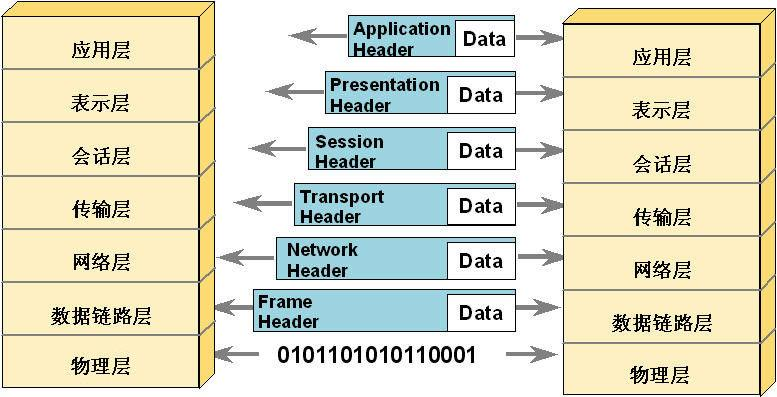

# 1.项目背景
现有端上请求后端接口采用TCP/HTTPs协议
对于mring/nobe/walle等部分需求
e.g.
* nobe中的请求待更新app的功能
* mring中已采用阿里云物联网平台的功能(采用了mqtt协议)
* walle中的行程接口等

端上采用轮询的方式请求接口 产生了不必要的消耗(即 每次接口请求都会三次握手建立tcp连接 -> http请求 -> 四次挥手关闭连接) 在请求过于频繁的情况下会造成服务器来不及回收tcp连接 接口无响应的情况(4.0 刚上线的时候因为服务器系统配置为HTTP短连接 回收不及时导致所有接口超时。改为HTTP长连接之后对于一台设备 短时间只需要建立一次TCP连接 数据传输的通道可以复用)
# 2.术语介绍
mqtt, websocket, http协议都是建立在TCP协议的基础上的**应用层**协议

## MQTT
即消息队列遥测传输(Message Queuing Telemetry Transport), 是一种基于发布订阅范式的消息协议。相较于HTTP 能节省更多的资源 带来较少的传输负担。
### 主要优点：
* client端非常轻量，使用资源比较少 且消息传输的headers通过优化能够减少带宽消耗。
* 可靠的消息送达保障。实现了三种Qos 见下文
* 双工通信 可以实现简单的广播/推送
* 对于不可靠网络条件提供支持(client与broker之间session的快速重连机制) 适合IOT的使用场景
* 可加密(TLS) 或者其他认证协议(OAuth)
### 标准架构：

MQTT 协议定义了两种网络实体：消息代理（message broker）与客户端（client）。其中，消息代理用于接收来自客户端的消息并转发至目标客户端。MQTT 客户端可以是任何运行有 MQTT 库并通过网络连接至消息代理的设备，例如微型控制器或大型服务器。

信息的传输是通过主题（topic）管理的。发布者有需要分发的数据时，其向连接的消息代理发送携带有数据的控制消息。代理会向订阅此主题的客户端分发此数据。发布者不需要知道订阅者的数据和具体位置；同样，订阅者不需要配置发布者的相关信息。

如果消息代理接受到某个主题上的消息，且这个主题没有任何订阅，那么代理就会丢弃之，除非发布者将其标记为保留消息（retained message）。

当发布客户端首次与代理连接时，客户端可以设置一个默认消息。当代理发现发布者意外断开，其会向订阅者发送此预设的消息。

客户端仅与代理有直接的数据传输，但整个系统中可能有多个代理，其于当前订阅者的主题交换数据。

MQTT 控制消息最小只有 2 字节的数据。最多可以承载 256 Mb 的数据。有 14 种预定义的消息类型用于：连接客户端与代理、断开连接、发布数据、确认数据接收、监督客户端与代理的连接。

MQTT 基于 TCP 协议，用于数据传输。变体 MQTT-SN 用于在蓝牙上传输，基于 UDP。

MQTT 协议使用普通文本发送连接认证书，且并不包含任何安全或认证相关的措施。但可以使用传输层安全来加密并保护发送的数据，以防止拦截、修改或伪造。

MQTT 默认端口为**1883**。加密的端口为**8883**.

## WebSocket
# 3.通信协议的改进