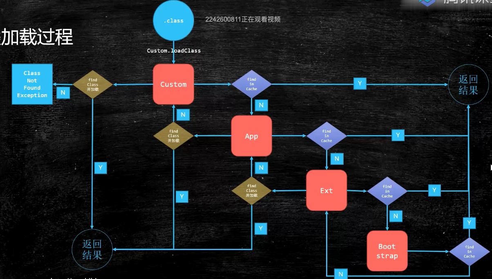

- [java执行顺序](#java执行顺序)
- [jvm](#jvm)
- [类加载器](#类加载器)
  - [加载顺序 (自顶向下)](#加载顺序-自顶向下)
  - [**重要** 双亲委派加载关系](#重要-双亲委派加载关系)
  - [什么时候初始化对象](#什么时候初始化对象)
  - [Linking阶段](#linking阶段)
  - [Initializing](#initializing)
  - [volatile的实现](#volatile的实现)
  - [synchronized的实现](#synchronized的实现)
- [对象的内存布局](#对象的内存布局)
  - [创建过程](#创建过程)
  - [存储布局](#存储布局)
    - [普通对象](#普通对象)
    - [数组对象](#数组对象)
  - [对象头](#对象头)
  - [定位](#定位)
  - [分配](#分配)
- [运行时数据区](#运行时数据区)
  - [Program Counter](#program-counter)
  - [Stacks](#stacks)
  - [Native Mehtod Stacks](#native-mehtod-stacks)
  - [Direct Memory](#direct-memory)
  - [Heap](#heap)
  - [Method area (即perm space 1.7前/ meta Space 1.8之后)](#method-area-即perm-space-17前-meta-space-18之后)
- [GC](#gc)
  - [判断垃圾的方法](#判断垃圾的方法)
  - [GC Algorithms](#gc-algorithms)
    - [Mark-Sweep](#mark-sweep)
    - [Copying](#copying)
    - [Mark-Compact](#mark-compact)
  - [堆内存逻辑分区](#堆内存逻辑分区)
    - [逻辑分代](#逻辑分代)
    - [分配](#分配-1)
      - [对象什么时候进入老年代](#对象什么时候进入老年代)
      - [分配担保](#分配担保)
- [常见垃圾回收器](#常见垃圾回收器)
  - [Serial + Serial Old](#serial--serial-old)
  - [ParNew + CMS （1.6/1.7）](#parnew--cms-1617)
    - [CMS存在的问题及原因](#cms存在的问题及原因)
    - [三色标记](#三色标记)
  - [Parallel Scavenge + ParallelOld](#parallel-scavenge--parallelold)
  - [G1 (10ms stw) （1.8之后）](#g1-10ms-stw-18之后)
  - [ZGC](#zgc)
  - [Shenadoah](#shenadoah)
- [业务场景采用](#业务场景采用)
  - [G1](#g1)
  - [跨代引用问题](#跨代引用问题)
  - [常用参数](#常用参数)

# java执行顺序

**javac** -> .class文件 -> ClassLoader(包含java类库 如String等) -> 解释器或者即时编译 ->执行引擎

# jvm

是一种规范 和java无关 和class文件有关
JVM -> JRE = JVM + core library -> JDK = jre + development kit

# 类加载器

class
-> loading
-> linking
    verification 验证class是否规范
    preparation 静态变量赋默认值 int = 0
    resolution 常量池中的符号引用转为能引用的
-> Initializing
    static 代码块, 将静态值赋初始值 int = 8

ClassLoader
属于顶级父类 所有class文件都是由classLoader的子类加载进内存的 进入内存中时 会生成两块内容：

1. 二进制文件
2. Class对象 指向上面的二进制内容(位于metaspace中?)
Method Area 1.7之前叫Permanent Generation 1.8之后叫metaspace

## 加载顺序 (自顶向下)

- Bootstrap 加载基础类 C++书写的
- Extension 扩展类 /ext
- App 加载classpath指定内容 自己写的类文件等
- CustomClassloader 自定义的classLoader

## **重要** 双亲委派加载关系

Bootstrap 加载extension/app 的classloader
如果自定义classloader未找到 去父加载器app 加载找 如果再没找到 去extension找 最后去bootstrap
之后bootstrap会反过来委派

为什么双亲委派
为了防止对基础类的修改 (主要是安全问题)
其次可以省资源

## 什么时候初始化对象

1. new get/put static invokestatic (打印final的值不需要加载)
2. 反射
3. 子类初始化 父类必须初始化
4. jvm启动的时候 执行主类
5. MethodHandle

## Linking阶段

- verification
  判断class是否符合规范
- preparation
  静态成员变量赋默认值 (int = 0...)
- Resolution (解析)
  ...

## Initializing

调用初始化代码

## volatile的实现

jvm层面 -> 内存读写都加屏障 保证所有数据对所有处理器可见
storestoreBarrier
写操作
storeloadBarrier

LoadLoadBarrier
读操作
storeloadBarrier

## synchronized的实现

monitorenter
代码块
monitorexit

有异常会monitorexit退出
jvm层面
操作系统提供的同步机制
硬件层面
lock 指令

# 对象的内存布局

## 创建过程

1. classloading
2. class linking
3. class initializing
4. 申请内存
5. 成员变量复制
6. 调用构造方法

## 存储布局

### 普通对象

1. 对象头 markword 8 bytes
2. Class指针 4/8 bytes 不压缩为8字节
   1. UserCompressClassPointers压缩自己的指针
3. 实例数据 成员变量
   1. UseCompressOops 开启时 引用类型的变量只占4bytes
4. Paddding 对齐 8的倍数

### 数组对象

1. 对象头 markword 8 bytes
2. Class指针 4/8 bytes 不压缩为8字节
3. 数组长度 4 bytes
4. 数组数据
5. Paddding 对齐 8的倍数

## 对象头

主要两部分 锁的指针 和gc分代年龄
GC默认年龄为15 是因为对象头上的分代年龄只有4bytes
当一个对象使用了自带的identityHashCode计算了hashcode时 不能进入偏向锁模式(因为存放偏向锁的位置被占据了) 重量级可以存

## 定位

1. 句柄池
a变量指向句柄池 句柄池指向实例数据 gc的时候效率较高
2. 直接指针
a变量直接指向堆中实例数据对象保存方法区类型数据指针，直接的访问实例数据 (gc效率比较低)

## 分配

stack -> 分配的下 分配到栈中 并且直接pop
如果对象比较大 会进入堆内存中 (老年代)
如果对象不大 会进入线程本地分配（TLAB） 分配的下进入线程本地内存 分配不下进入eden区
进入gc过程 年龄到了进入老年代 没到继续gc

# 运行时数据区

## Program Counter

->下一条指令存放位置

## Stacks

-> 每一个线程独有一个栈 每一个方法对应一个栈帧 装在Stack中(frame)
- 局部变量
  用局部变量表来存
- Operand Stack  
- 动态连接
- 返回地址
  返回下一个栈帧的地址
  invokeSpecial invokeVirtual invokeDynamic(匿名表达式) invokeInterface
new 对象 为半初始化 并且复制一份在栈帧中，之后弹出复制并且计算 调用init方法之后才会初始化

## Native Mehtod Stacks

-> 等同于本地方法的栈

## Direct Memory

直接内存 nio相关 (访问内核空间的内存)
以前的访问需要java复制到jvm中的内存空间 用户才能访问 现在用户可以通过直接内存区访问 (Zero-Copy)

## Heap

线程间共享

## Method area (即perm space 1.7前/ meta Space 1.8之后)

包含常量池和class 线程共享 1.8之前fgc不回收

# GC

## 判断垃圾的方法

1. 引用计数(RC)
   无法解决循环引用
2. 可达性分析
   从root对象开始搜索 stack变量 static变量 常量池 JNI指针 程序启动的时候马上需要的对象称为根对象

## GC Algorithms

### Mark-Sweep

标记清除 找到不需要使用的 清除 **在存活对象比较多的时候效率比较高** 但是会经历两遍扫描 容易产生碎片 (不适合eden区)

### Copying

内存一分为二 复制有用的对象去另一半 清除另外一半
适合存活对象较少的情况 效率提高 没有碎片 但是会浪费空间调整对象引用 比较适合eden区

### Mark-Compact

整理之后并且压缩
会移动对象 效率偏低 但是不会产生碎片

## 堆内存逻辑分区

 (主流为分代模型)
 新生代 (1) + 老年代 (2) + 永久代(MetaSpcae)
 G1回收器属于逻辑分代 物理不分
 ZGC不分代

### 逻辑分代

- 新生代 （new / young）
  对象比较少 所以适用copying算法
  eden(8) + survivor(2)
  eden区回收一次之后 进入survivor
  在年轻代回收(年轻代空间耗尽)的称为minor gc 或者ygc
- 老年代 (old)
  垃圾回收很多次都没有被回收的 比较适合mark-compact算法
  老年代回收的称为fullgc (major gc)

### 分配

栈上分配(速度更快 不需要垃圾回收) -> thread local allocation buffer分配(每个线程在eden区中的独有的1%空间) -> 老年代(大对象) -> eden区

#### 对象什么时候进入老年代

XX:MaxTenuringThreshold 指定次数 (YGC次数)
Parallel Scavenge 15次
CMS 6次
G1 15次
动态年龄 (survivor 某个区使用超过了50% 年龄最大的放入Old)

#### 分配担保

YGC期间 survivor区空间不够了 空间担保直接进入老年代

# 常见垃圾回收器

## Serial + Serial Old

找一个safe point STW 复制算法 单线程gc 适合内存较小的情况
mark-compact方式收集

## ParNew + CMS （1.6/1.7）

ParNew 即为 parellel new (为parallel scavenge的增强 为了和cms配合)
CMS 为 concurrent mark sweep 分为四步

  1. inital mark 初始标记
      stw的标记 标记gc root
      如何确定GC root:
       1.虚拟机栈(栈帧中的本地变量表)中引用的对象；
       2.方法区中的类静态属性引用的对象
       3.方法区中的常量引用的对象
       4.原生方法栈（Native Method Stack）中 JNI 中引用的对象
       5.内部引用
       6.同步锁持有的对象
       7.本地代码缓存等

  2. concurrent mark (最浪费时间的阶段)
      并发的标记(指可以同时运行程序不被暂停)
       (三色扫描加Incremntal update 增量更新)

  3. remark
      重新标记(并行的) 并发标记阶段产生的垃圾重新标记 stw的标记

  4. concurrent sweep
      并发清理 此阶段产生的垃圾会在下一个过程清理

### CMS存在的问题及原因

1. 浮动垃圾 并行标记 所以会产生浮动垃圾

2. 由于CMS老年代使用标记-清除回收策略，因此会有内存碎片问题。当碎片过多时，将会给大对象分配带来麻烦，往往会出现老年代还有很多空间但就已经不能保存对象了。不得不提前触发一次Full GC。为了解决这个问题，CMS收集器提供了-XX:UseCMSCompactAtFullCollection开关参数，用于在CMS收集器不得不进行Full GC时开启内存碎片的合并整理过程。 有参数可以配置有多少次Full GC会堆内存碎片进行整理(-XX:CMSFullGCsBeforeCompaction)

### 三色标记

**三色标记具体指那三色？**

白色、灰色和黑色。

黑色：根对象，或者该对象与它的子对象都被扫描过。

灰色：对象本身被扫描，但是还有没扫描该对象的子对象。

白色：未被扫描的对象，如果扫描完成所有对象之后，最终为白色的为不可达对象，即垃圾对象、

**出现对象消失的问题 (黑色对象被误标记为白色)**

当且仅当以下两个条件同时满足：

  赋值器插入了一条或多条从黑色对象到白色对象的新引用；

  赋值器删除了全部从灰色对象到该白色对象的直接或间接引用。

**那如何解决并发扫描时对象消失问题？**

只需要破坏这两个条件任意一个即可，两种解决方案：增量更新（Increamental Update）和原始快照（Snap shot At The Begining, SATB）

CMS 基于 增量更新（Increamental Update）来做并发标记，G1 基于 原始快照（Snap shot At The Begining, SATB）来实现的。

增量更新（Increamental Update）：当一个白色对象被黑色对象引用，将黑色对象重新标记为灰色，让垃圾回收器重新扫描。

原始快照（Snap shot At The Begining, SATB）：原始快照要破坏的是第二个条件，当灰色对象要删除指向白色对象的引用关系时，就将这个要删除的引用记录下来，在并发扫描结束之后，再将这些记录过得引用关系中的灰色对象为根，重新扫描一次。总而言之就是：无论引用关系删除与否，都会按照刚刚开始扫描的那一刻的对象图快照来进行搜索

## Parallel Scavenge + ParallelOld

jdk默认的为PS+PO
和serial的区别为 清理垃圾的线程为多线程 mark-compact方式收集

## G1 (10ms stw) （1.8之后）

concurrent mark阶段算法和cms不同 (三色标记加SATB(snapshot at beginning))

## ZGC

concurrent mark阶段算法和cms不同 (coloredPointers + 写屏障)

## Shenadoah

concurrent mark阶段算法和cms不同 (coloredPointers + 读屏障)

# 业务场景采用

吞吐量优先的可以使用PS + PO
响应时间优先的可以使用G1

## G1

一般来说200ms可以响应 如果需要高吞吐量可以使用PN
采用了divide and conquer的思想去管理内存模型 着重收集垃圾最多 存活对象最少的区域(Garbage First)

当老年代存活对象较多时，每次Minor GC查询老年代所有对象影响回收效率（因为GC会 stop-the-world），所以在老年代有一个write barrier（写屏障）来管理的card table（卡表），card table存放了所有老年代对象对新生代对象的引用

## 跨代引用问题

为了解决对象跨代引用的问题 使用card表和内存页的对应关系管理 如果存在跨代引用 即说明卡为dirty card

## 常用参数

-XX:+UseG1GC
-XX:+MaxGCPauseMillis 停顿时间
-XX:+NewSizePercent 新生代的最小比例
-XX:+NewMaxSizePercent 新生代的最大比例
-XX:+G1HeapRegionSize 建议逐渐增加 size增加 垃圾存活时间越长 GC时间更长 越小GC间隔时间短
-Xms400m 初始内存
-Xmx400m 最大内存
-XX:PermSize=200M 永久代大小
-XX:NewRatio=4 年轻代与老年代比例为4:6
-XX:SurvivorRatio=4 设置年轻代中Eden区与Survivor区的大小比值。设置为4，则两个Survivor区与一个Eden区的比值为2:4，一个Survivor区占整个年轻代的1/6
