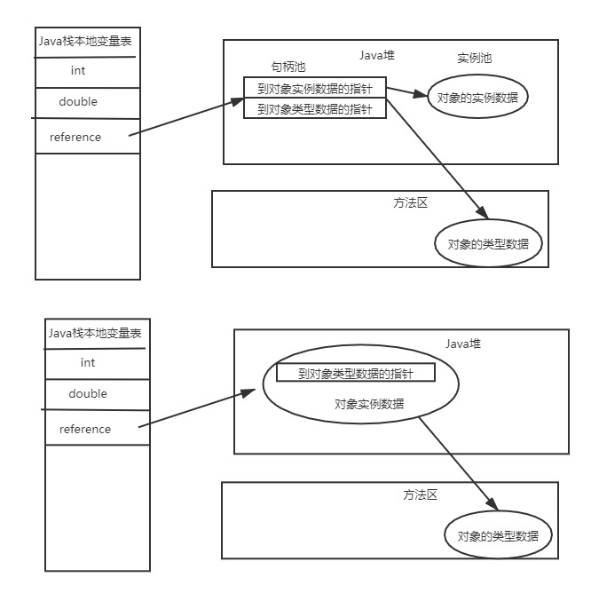

- [java执行顺序](#java执行顺序)
- [jvm](#jvm)
- [JMM](#JMM)
- [类加载器](#类加载器)
  - [加载顺序 (自顶向下)](#加载顺序-自顶向下)
  - [类加载机制](#类加载机制)
  - [**重要** 双亲委派加载关系](#重要-双亲委派加载关系)
  - [什么时候初始化对象](#什么时候初始化对象)
  - [Linking阶段](#linking阶段)
  - [Initializing](#initializing)
  - [volatile的实现](#volatile的实现)
  - [synchronized的实现](#synchronized的实现)
- [对象的内存布局](#对象的内存布局)
  - [创建过程](#创建过程)
  - [存储布局](#存储布局)
    - [普通对象](#普通对象)
    - [数组对象](#数组对象)
  - [对象头](#对象头)
  - [定位](#定位)
  - [分配](#分配)
- [运行时数据区](#运行时数据区)
  - [Program Counter](#program-counter)
  - [Stacks](#stacks)
  - [Native Mehtod Stacks](#native-mehtod-stacks)
  - [Direct Memory](#direct-memory)
  - [Heap](#heap)
  - [Method area (即perm space 1.7前/ meta Space 1.8之后)](#method-area-即perm-space-17前-meta-space-18之后)
- [GC](#gc)
  - [判断垃圾的方法](#判断垃圾的方法)
  - [GC Algorithms](#gc-algorithms)
    - [Mark-Sweep](#mark-sweep)
    - [Copying](#copying)
    - [Mark-Compact](#mark-compact)
  - [堆内存逻辑分区](#堆内存逻辑分区)
    - [逻辑分代](#逻辑分代)
    - [分配](#分配-1)
      - [对象什么时候进入老年代](#对象什么时候进入老年代)
      - [分配担保](#分配担保)
- [常见垃圾回收器](#常见垃圾回收器)
  - [Serial + Serial Old](#serial--serial-old)
  - [ParNew + CMS （1.6/1.7）](#parnew--cms-1617)
    - [CMS存在的问题及原因](#cms存在的问题及原因)
    - [三色标记](#三色标记)
  - [Parallel Scavenge + ParallelOld](#parallel-scavenge--parallelold)
  - [G1 (10ms stw) （1.8之后）](#g1-10ms-stw-18之后)
  - [ZGC](#zgc)
  - [Shenadoah](#shenadoah)
- [业务场景采用](#业务场景采用)
  - [G1](#g1)
  - [跨代引用问题](#跨代引用问题)
  - [常用参数](#常用参数)
  - [G1如何确保停顿时间](#g1如何确保停顿时间)

# java执行顺序

**javac** -> .class文件 -> ClassLoader(包含java类库 如String等) -> 解释器或者即时编译 ->执行引擎

# jvm

是一种规范 和java无关 和class文件有关
JVM -> JRE = JVM + core library -> JDK = jre + development kit

# 类加载器

class
-> loading  （加载）
-> linking  
    verification （验证）验证class是否规范  
    preparation （准备）为类变量在方法区分配内存，并赋默认值 int = 0  
    resolution （解析）常量池中的符号引用转为直接引用  
-> Initializing  （初始化）
    static 代码块, 将静态变量赋初始值 int = 8  

ClassLoader
属于顶级父类 所有class文件都是由classLoader的子类加载进内存的 进入内存中时 会生成两块内容：

1. 二进制文件  
2. Class对象 作为方法区的入口 指向上面的二进制内容(位于metaspace中)  

补充：
Method Area 1.7之前叫Permanent Generation 1.8之后叫metaspace，字符串常量池放入堆中  
把永久代从jvm移除的原因？  
1.jdk1.8之前字符串常量池放在永久代，容易造成出现性能问题和内存溢出，而且只会在fullgc才会扫描清理永久代，效率低下  
2.类以及方法的信息不容易确定其大小，放在系统内存中更适合。

## JMM
### 硬件层数据一致性
协议很多  
intel 用MESI
现代CPU的数据一致性实现 = 缓存锁（MESI）+总线锁  
总线锁：操作系统提供了总线锁定的机制。前端总线(也叫CPU总线)是所有CPU与芯片组连接的主干道，负责CPU与外界所有部件的通信，包括高速缓存、内存、北桥，其控制总线向各个部件发送控制信号、通过地址总线发送地址信号指定其要访问的部件、通过数据总线双向传输。在CPU1要操作共享变量的时候，其在总线上发出一个LOCK#信号，其他处理器就不能操作缓存了该共享变量内存地址的缓存，也就是阻塞了其他CPU，使该处理器可以独享此共享内存。  
总线锁定把CPU和内存的通信给锁住了，使得在锁定期间，其他处理器不能操作其他内存地址的数据，从而开销较大。

读取缓存以cache line为基本单位，目前64bytes  
位于统一缓存行的两个不同数据，被两个不同cpu锁定，产生互相影响的伪共享问题  
使用缓存行的对齐能够提高效率  

### 乱序问题  
CPU为了提高指令执行效率，会在一条指令执行过程中（比如去内存读数据（慢100倍）），去同时执行另一条指令，前提是，两条指令没有依赖关系  

### 如何表征保证特定情况下不乱序
硬件内存屏障 X86
>  sfence:  store| 在sfence指令前的写操作当必须在sfence指令后的写操作前完成。
>  lfence：load | 在lfence指令前的读操作当必须在lfence指令后的读操作前完成。
>  mfence：modify/mix | 在mfence指令前的读写操作当必须在mfence指令后的读写操作前完成。

> 原子指令，如x86上的”lock …” 指令是一个Full Barrier，执行时会锁住内存子系统来确保执行顺序，甚至跨多个CPU。Software Locks通常使用了内存屏障或原子指令来实现变量可见性和保持程序顺序

JVM级别如何规范（JSR133）

> LoadLoad屏障：
>   	对于这样的语句Load1; LoadLoad; Load2， 
>
>  	在Load2及后续读取操作要读取的数据被访问前，保证Load1要读取的数据被读取完毕。
>
> StoreStore屏障：
>
>  	对于这样的语句Store1; StoreStore; Store2，
>	
>  	在Store2及后续写入操作执行前，保证Store1的写入操作对其它处理器可见。
>
> LoadStore屏障：
>
>  	对于这样的语句Load1; LoadStore; Store2，
>	
>  	在Store2及后续写入操作被刷出前，保证Load1要读取的数据被读取完毕。
>
> StoreLoad屏障：
> 	对于这样的语句Store1; StoreLoad; Load2，
>
> ​	 在Load2及后续所有读取操作执行前，保证Store1的写入对所有处理器可见。

## 加载顺序 (自顶向下)

- Bootstrap 加载基础类 C++书写的
- Extension 扩展类 /ext
- App 加载classpath指定内容 自己写的类文件等
- CustomClassloader 自定义的classLoader

### 实现自定义类加载器 为什么需要自定义内加载器 如何打破双亲委派机制？
   继承自ClassLoader，重写findClass方法  
   重写loadClass 可打破双亲委派机制  
   自定类加载器的使用场景  
   （1）隔离加载类：在某些框架内进行中间件与应用的模块隔离，把类加载到不同的环境。比如，某容器框架通过自定义类加载器确保应用中依赖的jar包不会影响到中间件运行时使用的jar包。（jar包之间的冲突的消除）

（2）修改类加载方式：类的加载模型并非强制，除Bootstrap外，其它的加载并非一定要引入，或者根据实际情况在某个时间点进行按需动态加载。

（3）扩展加载源：比如从数据库、网络，甚至是电视机机顶盒进行加载。

（4）防止源码泄露。java代码容易被编译和篡改，可以进行编译加密。那么类加载器也需要自定义，还原加密的字节码。

## **重要** 双亲委派加载关系

Bootstrap 加载extension/app 的classloader
如果自定义classloader未找到 去父加载器app 加载找 如果再没找到 去extension找 最后去bootstrap
之后bootstrap会反过来委派

为什么双亲委派
为了防止对基础类的修改 (主要是安全问题)
其次可以省资源

## 什么时候初始化对象

1. new、get（获取类变量的值，被final修饰的除外，他的值在编译器时放到了常量池）/put（给类变量赋值） static invokestatic (调用静态方法)
2. 反射
3. 子类初始化 父类必须初始化
4. jvm启动的时候 执行主类main方法
5. MethodHandler

## Linking阶段

- verification
  判断class是否符合规范
- preparation
  静态成员变量赋默认值 (int = 0...)
- Resolution (解析)
  将类、方法、属性等符号引用解析为直接引用 常量池中的各种符号引用解析为指针、偏移量等内存地址的直接引用

## Initializing

执行static代码，调用初始化代码

## volatile的实现
1.字节码层面 ACC_VOLATILE
2.jvm层面 -> 内存读写都加屏障 保证所有数据对所有处理器可见  
>storestoreBarrier  
>写操作  
>storeloadBarrier  
  
>LoadLoadBarrier  
>读操作  
>storeloadBarrier  

3.OS和硬件层面 （总线锁/缓存锁+MESI）
   https://blog.csdn.net/qq_26222859/article/details/52235930  
   hsdis - HotSpot Dis Assembler  
   windows lock 指令实现 | MESI实现  
   当多处理器之间的竞争程度很高或者指令访问的内存地址未对齐时，仍然会锁住总线  
## synchronized的实现
1.字节码层面
ACC_SYNCHRONIZED
monitorenter  
代码块  
monitorexit  

有异常会monitorexit退出  
2.jvm层面  
c c++ 调用了操作系统提供的同步机制  
3.os和硬件层面  
lock 指令  

# 对象的内存布局

## 创建过程

1. class loading
2. class linking
3. class initializing
4. 申请对象内存
5. 成员变量赋默认值
6. 调用构造方法（1.成员变量赋初始值   2.执行构造方法语句）

## 存储布局

### 普通对象

1. 对象头 markword 8 bytes
2. Class指针 4/8 bytes 不压缩为8字节
   1. UseCompressClassPointers压缩自己的指针
3. 实例数据 成员变量
   1. UseCompressOops 开启时 引用类型的变量只占4bytes
4. Paddding 对齐 8的倍数

### 数组对象

1. 对象头 markword 8 bytes
2. Class指针 4/8 bytes 不压缩为8字节
3. 数组长度 4 bytes
4. 数组数据
5. Paddding 对齐 8的倍数

## 对象头

markword里面装的是什么？  
第一是锁的信息 后三位分别是偏向锁的标志位、锁的标志位，代表对象有没有被锁定；  
第二是GC回收的次数以及分代年龄；第三是hashcode值；第四是线程id。  
GC默认年龄为15 是因为对象头上的分代年龄只有4bytes  
当一个对象使用了自带的identityHashCode计算了hashcode时 不能进入偏向锁模式(因为存放偏向锁的位置被占据了) 重量级可以存  

## 定位

1. 句柄池  
如果使用句柄访问方式，Java堆中会划分出一块内存来作为句柄池，reference中存储的就是对象的句柄地址，而句柄中包含了对象实例数据和类型数据各自的具体地址信息。使用句柄方式最大的好处就是reference中存储的是稳定的句柄地址，在对象被移动（垃圾收集时移动对象是非常普遍的行为）时只会改变句柄中的实例数据指针，而reference本身不需要被修改。

2. 直接指针  
如果使用该方式，Java堆对象的布局就必须考虑如何放置访问类型数据的相关信息，reference中直接存储的就是对象地址。使用直接指针方式最大的好处就是速度更快，他节省了一次指针定位的时间开销。

## 分配

首先new一个对象的时候，先往栈上分配，栈上如果可以分配下就分配在栈上，然后栈上一弹出就没了，如果栈上分配不下，对象特别的大直接分配到堆内存，也就是老年代，如果对象不大，首先会进行线程本地分配，如果分配不下，会找到伊甸区然后进行GC过程，在GC的过程中年龄到了一定大小就会直接进入老年代，如果年龄没到，就会一次一次GC直到年龄到达为止

# 运行时数据区

## Program Counter

->下一条指令存放位置，是线程私有的  
**问题：为什么程序计数器是私有的，不能线程共享？**  
因为线程的切换，CPU在执行的过程中，一个线程执行完了，接下来CPU切换到另一个线程去执行，另外一个线程执行完再切回到之前的线程，这时需要记住原线程的下一条指令的位置，所以每一个线程都需要有自己的PC。  

## Stacks

-> 每一个线程独有一个栈 每一个方法对应一个栈帧 装在Stack中(frame)
- 局部变量
  用局部变量表来存
- Operand Stack  
- 动态链接
- 返回地址
  返回下一个栈帧的地址  
  invokeSpecial invokeVirtual invokeDynamic(匿名表达式) invokeInterface  
new 对象 为半初始化 并且复制一份在栈帧中，之后弹出复制并且计算 调用init方法之后才会初始化

**操作数栈**:是用来记录一个方法在执行的过程中，字节码指令向操作数栈中进行入栈和出栈的过程。大小在编译的时候已经确定了，当一个方法刚开始执行的时候，操作数栈中是空发的，在方法执行的过程中会有各种字节码指令往操作数栈中入栈和出栈。  
**动态链接**：因为字节码文件中有很多符号的引用，这些符号引用一部分会在类加载的解析阶段或第一次使用的时候转化成直接引用，这种称为静态解析；另一部分会在运行期间转化为直接引用，这部分称为动态链接。  
**返回地址**（returnAddress）：类型（指向了一条字节码指令的地址）

## Native Mehtod Stacks

等同于本地方法的栈。不同的是虚拟机栈服务的是Java方法，而本地方法栈服务的是Native方法。在HotSpot虚拟机实现中是把本地方法栈和虚拟机栈合二为一的，同理它也会抛出StackOverflowError和OOM异常

## Direct Memory

直接内存 nio相关 (访问内核空间的内存) 
以前的访问需要java复制到jvm中的内存空间 用户才能访问 现在用户可以通过直接内存区访问 (Zero-Copy)

补充：
  
从上途中，我们可以看出，一次数据的读写操作，需要经过如下步骤：  
1.数据从磁盘/网卡拷贝到内核空间，再从内核空间拷贝到用户空间（JVM）  
2.程序可能进行数据修改等操作  
3.再将处理后的数据拷贝到内核空间，内核空间再拷贝到磁盘/网卡，通过网络发送出去（或拷贝到磁盘）  
上面的分析，我们也能看出：   
一次 数据的读写（用户空间 发到 网络 也算作 写），都 至少 需要 两次拷贝，至多 需要 四次拷贝  
在这期间，由于 涉及到 用户空间 和 内核空间 的操作，因此需要涉及到 用户态 和 内核态 的相互切换  

数据 从 磁盘/网卡 拷贝到 直接内存  
程序 可能进行 数据修改 等操作，直接操作 直接内存 中的对象实例
再将 处理后的数据，从 直接内存 拷贝到 磁盘/网卡

总结：  
零拷贝 是 直接内存 的 特征，直接内存 是 零拷贝 的 实现原理
零拷贝 并 不是 代表 不进行拷贝  
而是 少了 用户空间 和 内核空间 之间的拷贝，但是 数据从 直接内存 与 磁盘/网卡 的 拷贝确是 少不了的

## Heap

线程间共享

## Method area (即perm space 1.7前/ meta Space 1.8之后)

包含常量池和class 线程共享 1.8之前fgc不回收

# GC

## 判断垃圾的方法

1. 引用计数(RC)
   无法解决循环引用
2. 可达性分析
   从root对象开始搜索 stack变量 static变量 常量池 JNI指针 程序启动的时候马上需要的对象称为根对象

在Java语言中，可作为GC Roots的对象包含以下几种：

虚拟机栈(栈帧中的本地变量表)中引用的对象。(可以理解为:引用栈帧中的本地变量表的所有对象)    
方法区中静态属性引用的对象(可以理解为:引用方法区该静态属性的所有对象)  
方法区中常量引用的对象(可以理解为:引用方法区中常量的所有对象)  
本地方法栈中(Native方法)引用的对象(可以理解为:引用Native方法的所有对象)  

## GC Algorithms

### Mark-Sweep

标记清除 找到不需要使用的 清除 **在存活对象比较多的时候效率比较高** 但是会经历两遍扫描 容易产生碎片 (不适合eden区)

### Copying

内存一分为二 复制有用的对象去另一半 清除另外一半
适合存活对象较少的情况 效率提高 没有碎片 但是会浪费空间调整对象引用 比较适合eden区

### Mark-Compact

整理之后并且压缩
会移动对象 效率偏低 但是不会产生碎片

## 堆内存逻辑分区

 (主流为分代模型)
 新生代 (1) + 老年代 (2) + 永久代(MetaSpcae)
 G1回收器属于逻辑分代 物理不分
 ZGC不分代

### 逻辑分代

- 新生代 （new / young）
  对象比较少 所以适用copying算法
  eden(8) + survivor(2)
  eden区回收一次之后 进入survivor
  在年轻代回收(年轻代空间耗尽)的称为minor gc 或者ygc
- 老年代 (old)
  垃圾回收很多次都没有被回收的 比较适合mark-compact算法
  老年代回收的称为fullgc (major gc)

### 分配

栈上分配(速度更快 不需要垃圾回收) -> thread local allocation buffer分配(每个线程在eden区中的独有的1%空间) -> 老年代(大对象) -> eden区

#### 对象什么时候进入老年代

XX:MaxTenuringThreshold 指定次数 (YGC次数)
Parallel Scavenge 15次
CMS 6次
G1 15次
动态年龄 (survivor 某个区使用超过了50% 年龄最大的放入Old)

#### 分配担保

YGC期间 survivor区空间不够了 空间担保直接进入老年代

# 常见垃圾回收器

## Serial + Serial Old

找一个safe point STW 复制算法 单线程gc 适合内存较小的情况
mark-compact方式收集

## ParNew + CMS （1.6/1.7）

ParNew 即为 parellel new (为parallel scavenge的增强 为了和cms配合)
CMS 为 concurrent mark sweep 分为四步

  1. inital mark 初始标记
      stw的标记 标记gc root  
      如何确定GC root:  
       1.虚拟机栈(栈帧中的本地变量表)中引用的对象； 
       2.方法区中的类静态属性引用的对象  
       3.方法区中的常量引用的对象  
       4.原生方法栈（Native Method Stack）中 JNI 中引用的对象  
       5.内部引用  
       6.同步锁持有的对象  
       7.本地代码缓存等  

  2. concurrent mark (最浪费时间的阶段)
      并发的标记(指可以同时运行程序不被暂停)
       (三色扫描加Incremental update 增量更新)

  3. remark
      重新标记(并行的) 并发标记阶段产生的垃圾重新标记 stw的标记

  4. concurrent sweep
      并发清理 此阶段产生的垃圾会在下一个过程清理

### CMS存在的问题及原因

1. 浮动垃圾 并行标记 所以会产生浮动垃圾

2. 由于CMS老年代使用标记-清除回收策略，因此会有内存碎片问题。当碎片过多时，将会给大对象分配带来麻烦，往往会出现老年代还有很多空间但就已经不能保存对象了。不得不提前触发一次Full GC。为了解决这个问题，CMS收集器提供了-XX:UseCMSCompactAtFullCollection开关参数，用于在CMS收集器不得不进行Full GC时开启内存碎片的合并整理过程。 有参数可以配置有多少次Full GC会堆内存碎片进行整理(-XX:CMSFullGCsBeforeCompaction)

### 三色标记

**三色标记具体指那三色？**

白色、灰色和黑色。

黑色：根对象，或者该对象与它的子对象都被扫描过。

灰色：对象本身被扫描，但是还有没扫描该对象的子对象。

白色：未被扫描的对象，如果扫描完成所有对象之后，最终为白色的为不可达对象，即垃圾对象、

**出现对象消失的问题 (黑色对象被误标记为白色)**

当且仅当以下两个条件同时满足：

  赋值器插入了一条或多条从黑色对象到白色对象的新引用；

  赋值器删除了全部从灰色对象到该白色对象的直接或间接引用。

**那如何解决并发扫描时对象消失问题？**

只需要破坏这两个条件任意一个即可，两种解决方案：增量更新（Increamental Update）和原始快照（Snap shot At The Begining, SATB）

CMS 基于 增量更新（Increamental Update）来做并发标记，G1 基于 原始快照（Snap shot At The Begining, SATB）来实现的。

增量更新（Increamental Update）：当一个白色对象被黑色对象引用，将黑色对象重新标记为灰色，让垃圾回收器重新扫描。

原始快照（Snap shot At The Begining, SATB）：原始快照要破坏的是第二个条件，当灰色对象要删除指向白色对象的引用关系时，就将这个要删除的引用记录下来，在并发扫描结束之后，再将这些记录过得引用关系中的灰色对象为根，重新扫描一次。总而言之就是：无论引用关系删除与否，都会按照刚刚开始扫描的那一刻的对象图快照来进行搜索

## Parallel Scavenge + ParallelOld

jdk默认的为PS+PO
和serial的区别为 清理垃圾的线程为多线程 mark-compact方式收集

## G1 (10ms stw) （1.8之后）

concurrent mark阶段算法和cms不同 (三色标记加SATB(snapshot at beginning))

## ZGC

concurrent mark阶段算法和cms不同 (coloredPointers + 写屏障)

## Shenadoah

concurrent mark阶段算法和cms不同 (coloredPointers + 读屏障)

# 业务场景采用

吞吐量优先的可以使用PS + PO  
响应时间优先的可以使用G1

## G1

一般来说200ms可以响应 如果需要高吞吐量可以使用PN
采用了divide and conquer的思想去管理内存模型 着重收集垃圾最多 存活对象最少的区域(Garbage First)

当老年代存活对象较多时，每次Minor GC查询老年代所有对象影响回收效率（因为GC会 stop-the-world），所以在老年代有一个write barrier（写屏障）来管理的card table（卡表），card table存放了所有老年代对象对新生代对象的引用

补充：
G1特点

并发收集

压缩空闲空间不会延长GC的暂停时间

更易预测的GC停顿时间

适用不需要实现很高的吞吐量的场景

CSet

一组可被回收的分区的集合

在CSet中存活的数据会在GC过程中被移动到另一个可用分区

CSet中的分区可以来自Eden空间、survivor空间、或者老年代

CSet会占用不到整个堆空间的1%大小

card table

* Card Table
  由于做YGC时，需要扫描整个OLD区，效率非常低，所以JVM设计了CardTable， 如果一个OLD区CardTable中有对象指向Y区，就将它设为Dirty，下次扫描时，只需要扫描Dirty Card
  在结构上，Card Table用BitMap来实现
  
RSet 

记录了其他Region中的对象到本Region中的引用

Rset的价值在于

使得垃圾回收器不需要扫描整个堆找到谁引用了当前分区中的对象。

只需要扫描Rset即可

由于Rset的存在，那么每次给对象赋引用的时候，就得做一些额外的操作

指的是在Rset中做一些额外的记录（在GC中被称为写屏障）

新老年代比例

5%-60%

-一般不用手工指定

-也不要手工指定，因为这是G1预测停顿时间的基准

## 跨代引用问题

为了解决对象跨代引用的问题 使用card表和内存页的对应关系管理 如果存在跨代引用 即说明卡为dirty card

## 常用参数

-XX:+UseG1GC
-XX:+MaxGCPauseMillis 停顿时间
-XX:+NewSizePercent 新生代的最小比例
-XX:+NewMaxSizePercent 新生代的最大比例
-XX:+G1HeapRegionSize 建议逐渐增加 size增加 垃圾存活时间越长 GC时间更长 越小GC间隔时间短

-Xms400m 初始内存
-Xmx400m 最大内存
-XX:PermSize=200M 永久代大小
-XX:NewRatio=4 年轻代与老年代比例为4:6
-XX:SurvivorRatio=4 设置年轻代中Eden区与Survivor区的大小比值。设置为4，则两个Survivor区与一个Eden区的比值为2:4，一个Survivor区占整个年轻代的1/6

## G1如何确保停顿时间  

G1虽然任然保留新生代和老年代的概念，但新生代和老年代不再是固定的了，它们都是一系列区域的动态集合。G1收集器之所以能建立可预测的停顿时间模型，是因为它将Region作为单次回收的最小单元，即每次收集到的内存空间都是Region大小的整数倍，这样可以有计划地避免在整个Java堆中尽心全区域的垃圾收集。更具体的处理思路是让G1收集器去跟踪各个Region里面的垃圾堆积的"价值"大小，价值即回收所获得的空间大小以及回收所需时间的经验值，然后在后台维护一个优先级列表，每次根据用户设置的允许的收集停顿时间(参数-XX:MaxGCPauseMillis指定，默认200毫秒)，优先处理回收价值收益最大的那些Region，也就是"Garbage First"名字的由来。---这种使用Region划分内存空间，以及具有优先级的区域回收方式，保证了G1收集器在有限时间内获取尽可能高的收集效率。

用户通过-XX:MaxGCPauseMillis参数指定的停顿时间只意味着垃圾收集发生之前的期望值，但G1收集器要怎么做才能满足用户的期望呢？G1收集器的停顿预测模型是以衰减均值(Decaying Average)为理论基础来实现的，在垃圾收集过程中，G1收集器会记录每个Region的回收耗时、每个Region记忆集里的脏卡数量等各个可测量的步骤花费的成本，并分析得出平均值、标准偏差、置信度等统计信息。话句话说,Region的统计状态越新越能决定其回收的价值。然后通过这些信息预测现在开始回收的话，有哪些Region组成的回收集才可以在不超过期望停顿时间的约束下获得最高的收益

