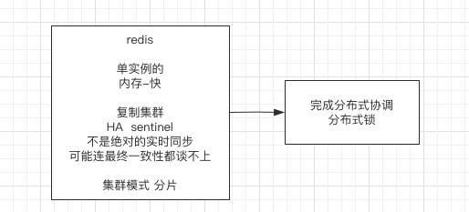
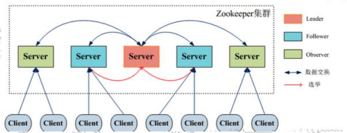
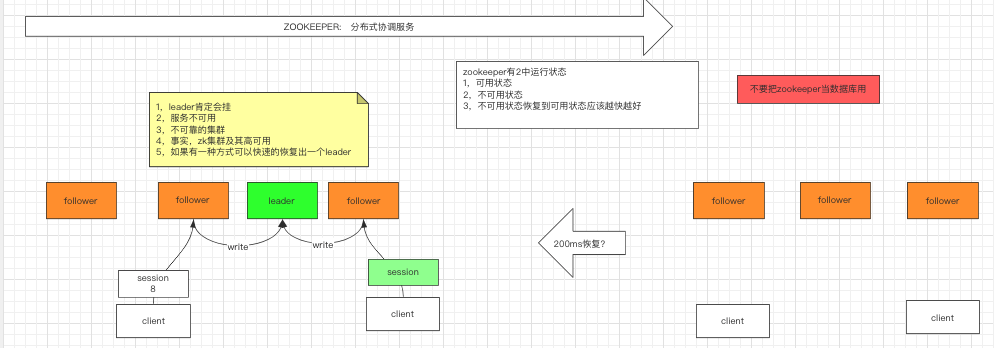
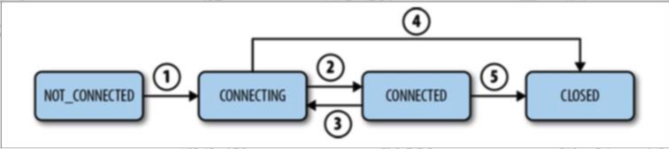
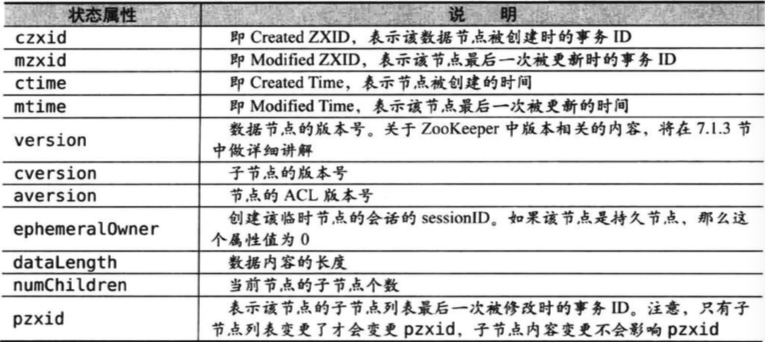
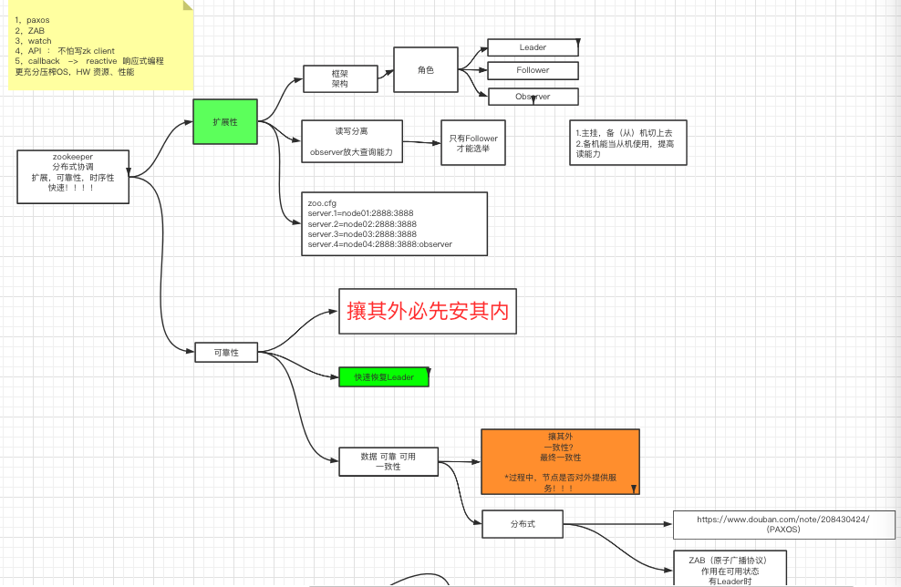
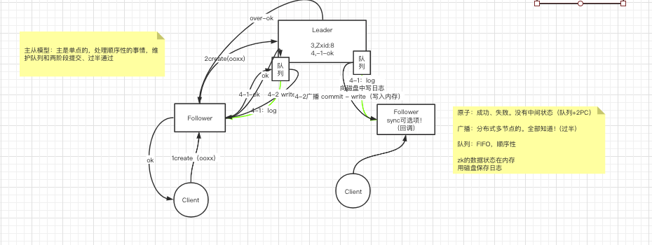
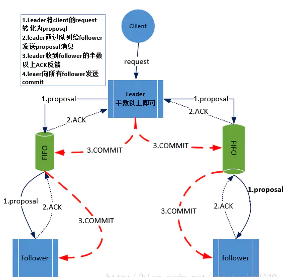
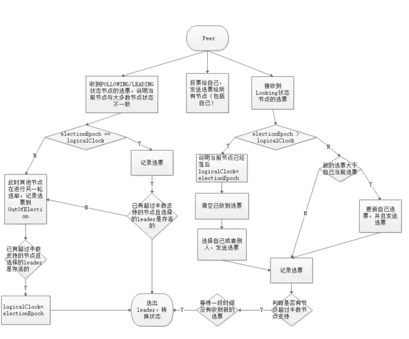
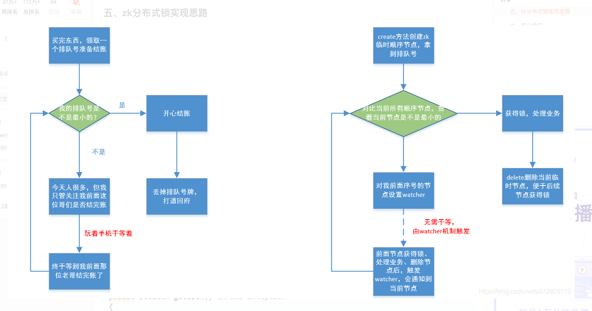

# 1.redis回顾




# 2.zookeeper 名词复盘

## 2.1集群角色

、




zk的特点：

顺序一致性-客户端的更新将按发送顺序应用

原子性-要么成功或失败，没有部分结果

统一视图-无论客户端连接到哪个服务器，客户端都能看到相同的服务视图

可靠性-一旦应用更新，它将从那时持续到客户端覆盖更新

及时性-系统的客户视图保证在特定时间范围内是最新的


## 2.2 **数据模型**

zk的视图结构和标准的文件系统非常类似，每一个节点称之为ZNode，是zk的最小单元。每个znode1上都可以保存数据以及挂载子节点。构成一个层次化的树形结构

**节点类型**

持久节点（PERSISTENT）

创建后会一直存在zk服务器上，直到主动删除

持久有序节点（PERSISTENT_SEQUENTIAL）

每个节点都会为它的一级子节点维护一个顺序

临时节点（EPHEMERAL）

临时节点的生命周期和客户端的会话绑定在一起，当客户端会话失效该节点自动清理

临时有序节点（EPHEMERAL）

在临时节点的基础上多了一个顺序性


CONTAINER 当子节点都被删除后，Container 也随即删除 PERSISTENT_WITH_TTL 超过 TTL 未被修改，且没有子节点 PERSISTENT_SEQUENTIAL_WITH_TTL 客户端断开连接后不会 自动删除 Znode，如果该 Znode 没有子 Znode 且在给定 TTL 时 间内无修改，该 Znode 将会被删除;TTL 单位是毫秒，必须大于 0 且小于或等于 EphemeralType.MAX_TTL


## 2.3 会话




​	1.client初始化链接，状态转为 CONNECTING(1)

​    2.client与server成功建立链接，状态转为connected（2）

​    3.client丢失了与server的连接或者没有接收到server的响应，状态转为connecting

​    4.client连上另外的server或连接上了之前的server，状态转为connected（2）

​    5.若会话过期（是server负责声明会话过期，而不是client），状态转为closed（5）

​    6.client也可以主动关闭会话（4）状态转为closed

​    **stat状态信息**

​    每个节点除了存储数据内容以外，还存储了数据节点本身的一些状态信息，通过get命令可以获得状态信息的详细内容




**版本-保证分布式数据原子性**

zookeeper 为数据节点引入了版本的概念，每个数据节点都有三 类版本信息，对数据节点任何更新操作都会引起版本号的变化

version ：当前数据节点数据内容的版本号

cversion：当前数据节点子节点的版本号

aversion：当前数据节点ACL变更版本号

版本有点和我们经常使用的乐观锁类似。

悲观锁:是数据库中一种非常典型且非常严格的并发控制策 略。假如一个事务 A 正在对数据进行处理，那么在整个处理 过程中，都会将数据处于锁定状态，在这期间其他事务无法 对数据进行更新操作。 乐观锁:乐观锁和悲观锁正好想法，它假定多个事务在处理 过程中不会彼此影响，因此在事务处理过程中不需要进行加 锁处理，如果多个事务对同一数据做更改，那么在更新请求 提交之前，每个事务都会首先检查当前事务读取数据后，是 否有其他事务对数据进行了修改。如果有修改，则回滚事务 再回到 zookeeper，version 属性就是用来实现乐观锁机制的 “写入校验”

**Watch**
zk提供了分布式数据的发布/订阅功能，zk允许客户端向服务端注册一个watch监听，当服务端的一些指定时间触发了watcher，那么服务端就会向客户端发送一个事件通知。

值得注意的是，watch通知是一次性的，即一旦触发一次通知后，该watch就失效了，因此客户端需要反复注册watcher，即程序中在process里面又注册了watcher，否则，将无法获取c3节点的创建而导致子节点变化的事件。

## zk的watch机制

ZooKeeper 中 Watch 机制的，大体上ZooKeeper 实现的方式是通过客服端和服务端分别创建有观察者的信息列表。客户端调用 getData、exist 等接口时，首先将对应的 Watch 事件放到本地的 ZKWatchManager 中进行管理。服务端在接收到客户端的请求后根据请求类型判断是否含有 Watch 事件，并将对应事件放到 WatchManager 中进行管理。

在事件触发的时候服务端通过节点的路径信息查询相应的 Watch 事件通知给客户端，客户端在接收到通知后，首先查询本地的 ZKWatchManager 获得对应的 Watch 信息处理回调操作。

这种设计不但实现了一个分布式环境下的观察者模式，而且通过将客户端和服务端各自处理 Watch 事件所需要的额外信息分别保存在两端，减少彼此通信的内容，提升了服务的处理性能。

## 2.4 zk集群搭建

```shell
安装笔记：
准备  node01~node04
1,安装jdk，并设置javahome
*, node01:
2，下载zookeeper    zookeeper.apache.org
3,tar xf zookeeper.*.tar.gz
4,mkdir /opt/mashibing
5, mv  zookeeper  /opt/mashibing
6,vi /etc/profile
       export ZOOKEEPER_HOME=/opt/mashibing/zookeeper-3.4.6
       export PATH=$PATH:$ZOOKEEPER_HOME/bin
7,cd zookeeper/conf
8,cp zoo.sem*.cfg   zoo.cfg
9,vi zoo.cfg
     dataDir=
     server.1=node01:2888:3888
     #1号服务器 
10, mkdir -p /var/mashibing/zk
11,echo 1 >  /var/mashibing/zk/myid
12,cd /opt  &&  scp -r ./mashibing/  node02:`pwd`
13:node02~node04   创建 myid
14：启动顺序  1，2，3，4
15：zkServer.sh   start-foreground


zkCli.sh
   help
   ls /
    create  /ooxx  ""
    create -s /abc/aaa
    create -e /ooxx/xxoo
    create -s -e /ooxx/xoxo
    get /ooxx


netstat -natp   |   egrep  '(2888|3888)' 
```


Zoo.cfg 配置项：

```
tickTime：2000 心跳时间

initLimit:10  初始化限制   例如： 1个follower追随1个leader 初始化延迟时间 最多20s=2000*10/1000

syncLimit：5  leader给follower 下发心跳 5*2000/1000 = 10s 没有回应认为挂了

server.A=B：C：D 
- A 是一个数字，表示这个是第几号服务器
- B 是这个服务器的 ip 地址
- C 表示的是这个服务器与集群中的 Leader 服务器交换信息的端口
- D表示的是万一集群中的 Leader 服务器挂了，需要一个端口来重新进行选举，选出一个新的Leader，而这个端口就是用来执行选举时服务器相互通信的端口。

```


- 

  

每个节点能存取1M数据？
保证对外作为sevice提供协调服务的时候速度很快，减少所有网络带宽和数据通信时延




# 3.ZAB协议

# 3.1 什么是ZAB协议

zk是通过zab协议来保证分布式事务的最终一致性的

- zab协议是为分布式协调服务zk专门设计的支持崩溃恢复的原子广播协议，是zk保证数据一致性的核心算法。Zab借鉴了Paxos算法，但又不像Paxos那样，是一种通用的分布式一致性算法。**它是特别为Zookeeper设计的支持崩溃恢复的原子广播协议**。

- 在zk中主要依赖zab协议来保证数据一致性，基于该协议，zk实现了一种主备模型的系统架构来保证集群中各个副本之间数据的一致性

  这里的主备系统架构模型，即指只有一台客户端（Leader）负责处理外部的写事务请求，然后leader客户端将数据同步到其他Follwer节点

  

Zookeeper 客户端会随机的链接到 zookeeper 集群中的一个节点，如果是读请求，就直接从当前节点中读取数据；如果是写请求，那么节点就会向 Leader 提交事务，Leader 接收到事务提交，会广播该事务，只要超过半数节点写入成功，该事务就会被提交。




# 3.2 zab协议原理

zab协议要求每个leader都要经历三个阶段：发现、同步、广播

- 发现：要求zk集群必须选举出一个leader进程，同时leader会维护一个follower可用客户端列表。将来客户端可以和这些follower节点进行通信
- 同步：leader要负责将本身数据与follower完成同步，做到多副本存储。这样也体现了AP。Follower将队列中未处理完的请求消费完成后，写入本地事务日志中。
- 广播：leader可以接受客户端新的事务proposal请求，将新的proposal请求广播给所有的follower


# 3.2 ZAB协议 内容

zab协议包括两种基本的模式：**崩溃恢复**和**消息广播**

 协议过程

当整个集群启动过程中，或者当 Leader 服务器出现网络中弄断、崩溃退出或重启等异常时，Zab协议就会 **进入崩溃恢复模式**，选举产生新的Leader。

当选举产生了新的 Leader，同时集群中有过半的机器与该 Leader 服务器完成了状态同步（即数据同步）之后，Zab协议就会退出崩溃恢复模式，**进入消息广播模式**。

这时，如果有一台遵守Zab协议的服务器加入集群，因为此时集群中已经存在一个Leader服务器在广播消息，那么该新加入的服务器自动进入恢复模式：找到Leader服务器，并且完成数据同步。同步完成后，作为新的Follower一起参与到消息广播流程中。

协议状态切换

当leader出现崩溃退出或者机器重启，或是集群中不存在超过半数的服务器与leader保存正常的通信，zab就会再一次进入崩溃恢复，发起新一轮leader选举并实现数据同步。同步完成后又会进入消息广播模式，接受事务请求

保证消息有序

在整个消息广播中，leader会将每一个事务请求转换成对应的proposal来进行广播，并且在广播事务proposal之前。leader服务器会首先为这个事务proposal分配一个全局单递增的唯一ID，称之为事务ID（即zxid），由于zab协议需要保证每一个消息的严格的顺序关系，因此必须将每一个proposal按照其zxid的先后顺序进行排序和处理

### 消息广播

1）在zk集群中，数据副本的传递策略就是采用消息广播模式。zk中数据副本的同步方式与二阶段提交相似，但是却又不同。二段提交要求协调者必须等到所有的参与者全部反馈ACK确认消息后，在发送commit消息。要求所有的参与者要么全部成功，要么全部失败。二段提交会产生严重的阻塞问题。

2）zab协议中leader等待follower的ACK反馈消息是指”只要半数以上follower成功反馈即可，不需要收到全部follower反馈“



消息广播具体步骤

1）客户端发起一个写操作请求。

2）Leader 服务器将客户端的请求转化为事务 Proposal 提案，同时为每个 Proposal 分配一个全局的ID，即zxid。

3）Leader 服务器为每个 Follower 服务器分配一个单独的队列，然后将需要广播的 Proposal 依次放到队列中取，并且根据 FIFO 策略进行消息发送。

4）Follower 接收到 Proposal 后，会首先将其以事务日志的方式写入本地磁盘中，写入成功后向 Leader 反馈一个 Ack 响应消息。

5）Leader 接收到超过半数以上 Follower 的 Ack 响应消息后，即认为消息发送成功，可以发送 commit 消息。

6）Leader 向所有 Follower 广播 commit 消息，同时自身也会完成事务提交。Follower 接收到 commit 消息后，会将上一条事务提交。

zk采用ZAB协议的核心，就是只要有一台服务器提交了proposal，就要确保所有的服务器最终都能正确提交proposal。这也是CAP/BASE实现最终一致性的一个体现

leader服务器与每一个follower服务器之间都维护了一个单独的FIFO消息队列进行收发消息，使用队列消息可以做到异步解耦。leader和follower之间只需要往队列中发消息即可。如果使用同步的方式会引起阻塞，性能要下降很多

## 崩溃恢复

一旦leader服务器出现崩溃或者由于网络原因导致leader服务器失去了与过半follower的联系，那么就会进入崩溃恢复模式。

在zab协议汇总，为了保证程序的正确运行，整个恢复过程结束后需要选举出一个新的leader服务器。因此zab协议需要一个高效且可靠的leader选举算法，从而确保能够快速选举出新的leader

leader选举算法不仅仅需要让leader自己知道自己已经被选举为leader，同时还需要让集群中的所有其他机器也能够快速感知到选举产生的新leader服务器

崩溃恢复主要包括两个部分：**leader选举**和**数据恢复**

Zab 协议如何保证数据一致性

假设两种异常情况：
1、一个事务在 Leader 上提交了，并且过半的 Folower 都响应 Ack 了，但是 Leader 在 Commit 消息发出之前挂了。
2、假设一个事务在 Leader 提出之后，Leader 挂了。

要确保如果发生上述两种情况，数据还能保持一致性，那么 Zab 协议选举算法必须满足以下要求：

**Zab 协议崩溃恢复要求满足以下两个要求**：
1）**确保已经被 Leader 提交的 Proposal 必须最终被所有的 Follower 服务器提交**。
2）**确保丢弃已经被 Leader 提出的但是没有被提交的 Proposal**。

根据上述要求
Zab协议需要保证选举出来的Leader需要满足以下条件：
1）**新选举出来的 Leader 不能包含未提交的 Proposal** 。
即新选举的 Leader 必须都是已经提交了 Proposal 的 Follower 服务器节点。
2）**新选举的 Leader 节点中含有最大的 zxid** 。
这样做的好处是可以避免 Leader 服务器检查 Proposal 的提交和丢弃工作。

Zab如何数据同步

1）完成 Leader 选举后（新的 Leader 具有最高的zxid），在正式开始工作之前（接收事务请求，然后提出新的 Proposal），Leader 服务器会首先确认事务日志中的所有的 Proposal 是否已经被集群中过半的服务器 Commit。

2）Leader 服务器需要确保所有的 Follower 服务器能够接收到每一条事务的 Proposal ，并且能将所有已经提交的事务 Proposal 应用到内存数据中。等到 Follower 将所有尚未同步的事务 Proposal 都从 Leader 服务器上同步过来并且应用到内存数据中以后，Leader 才会把该 Follower 加入到真正可用的 Follower 列表中。

Zab数据同步过程中，如何处理需要丢弃的proposal

在 Zab 的事务编号 zxid 设计中，zxid是一个64位的数字。

其中低32位可以看成一个简单的单增计数器，针对客户端每一个事务请求，Leader 在产生新的 Proposal 事务时，都会对该计数器加1。而高32位则代表了 Leader 周期的 epoch 编号。

> epoch 编号可以理解为当前集群所处的年代，或者周期。每次Leader变更之后都会在 epoch 的基础上加1，这样旧的 Leader 崩溃恢复之后，其他Follower 也不会听它的了，因为 Follower 只服从epoch最高的 Leader 命令。

每当选举产生一个新的 Leader ，就会从这个 Leader 服务器上取出本地事务日志充最大编号 Proposal 的 zxid，并从 zxid 中解析得到对应的 epoch 编号，然后再对其加1，之后该编号就作为新的 epoch 值，并将低32位数字归零，由0开始重新生成zxid。

**Zab 协议通过 epoch 编号来区分 Leader 变化周期**，能够有效避免不同的 Leader 错误的使用了相同的 zxid 编号提出了不一样的 Proposal 的异常情况。

基于以上策略
**当一个包含了上一个 Leader 周期中尚未提交过的事务 Proposal 的服务器启动时，当这台机器加入集群中，以 Follower 角色连上 Leader 服务器后，Leader 服务器会根据自己服务器上最后提交的 Proposal 来和 Follower 服务器的 Proposal 进行比对，比对的结果肯定是 Leader 要求 Follower 进行一个回退操作，回退到一个确实已经被集群中过半机器 Commit 的最新 Proposal**。


## 协议实现

ZAB协议三个阶段：

1）**选举（Fast Leader Election）**
2）**恢复（Recovery Phase）**
3）**广播（Broadcast Phase）**

Fast Leader Election（快速选举）

成为leader的条件：

1）选epoch最大的

2）如果epoch相等，选择zxid最大的

3）如果epoch和zxid相等，选择server_id最大的（zoo.cfg中的myid）

节点在选举开始时，都默认投票给自己，当收到其他节点的选票是，会根据上面的leader判断条件更改自己的选票，然后重新发送选票给其他节点。**当有一个节点的的票超过半数，该节点会设置自己的状态为leading，其他节点会设置自己的状态为following**



#4.分布式锁

通过watch实现

Zk分布式锁的思路可以类比日常生活中在超时排队付款的场景：
1、每个请求都去zk创建一个临时顺序节点，可以拿到当前请求的序号
2、查看当前序号是不是最小的：如果是最小就可以获得锁处理业务，业务处理完成后删除锁，以便后续请求使用
3、如果不是最小的则对前一个节点序号设置watcher。当前一个请求处理完成，对应节点删除后watcher触发，当前请求可再次进行第2步
原文链接：https://blog.csdn.net/u012829112/article/details/114481349



# 5.总结

1.什么情况下zab协议会进入崩溃恢复模式？

- 当服务器启动时
- 当leader服务器出现网络中断，崩溃或者重启的情况
- 当集群中已经不存在过半的服务器与leader服务器保持正常通信

2.zab协议进入崩溃协议恢复模式会做什么？

   （1）当leader出现问题，zab协议进入崩溃恢复模式，并且选择出新的leader。当新的leader选举出来以后，如果集群中已经有过半机器完成了leader服务器的状态同步（数据同步），退出崩溃模式，进入消息广播模式

   （2）当新的机器加入到集群中的时候，如果已经存在leader服务器，那么新加入的服务器就会自觉进入崩溃恢复模式，找到leader进行数据同步

## 特殊情况下需要解决的两个问题

   问题一：已经被处理的事务请求（proposal）不能丢（commit的）

> 当 leader 收到合法数量 follower 的 ACKs 后，就向各个 follower 广播 COMMIT 命令，同时也会在本地执行 COMMIT 并向连接的客户端返回「成功」。但是如果在各个 follower 在收到 COMMIT 命令前 leader 就挂了，导致剩下的服务器并没有执行都这条消息。

- 如何解决 *已经被处理的事务请求（proposal）不能丢（commit的）* 呢？

1、选举拥有 proposal 最大值（即 zxid 最大） 的节点作为新的 leader。

> 由于所有提案被 COMMIT 之前必须有合法数量的 follower ACK，即必须有合法数量的服务器的事务日志上有该提案的 proposal，因此，zxid最大也就是数据最新的节点保存了所有被 COMMIT 消息的 proposal 状态。

2、新的 leader 将自己事务日志中 proposal 但未 COMMIT 的消息处理。

3、新的 leader 与 follower 建立先进先出的队列， 先将自身有而 follower 没有的 proposal 发送给 follower，再将这些 proposal 的 COMMIT 命令发送给 follower，以保证所有的 follower 都保存了所有的 proposal、所有的 follower 都处理了所有的消息。通过以上策略，能保证已经被处理的消息不会丢。

### 问题二：没被处理的事务请求（proposal）不能再次出现什么时候会出现事务请求被丢失呢？

> 当 leader 接收到消息请求生成 proposal 后就挂了，其他 follower 并没有收到此 proposal，因此经过恢复模式重新选了 leader 后，这条消息是被跳过的。 此时，之前挂了的 leader 重新启动并注册成了 follower，他保留了被跳过消息的 proposal 状态，与整个系统的状态是不一致的，需要将其删除。

- 如果解决呢？

Zab 通过巧妙的设计 zxid 来实现这一目的。

一个 zxid 是64位，高 32 是纪元（epoch）编号，每经过一次 leader 选举产生一个新的 leader，新 leader 会将 epoch 号 +1。低 32 位是消息计数器，每接收到一条消息这个值 +1，新 leader 选举后这个值重置为 0。

这样设计的好处是旧的 leader 挂了后重启，它不会被选举为 leader，因为此时它的 zxid 肯定小于当前的新 leader。当旧的 leader 作为 follower 接入新的 leader 后，新的 leader 会让它将所有的拥有旧的 epoch 号的未被 COMMIT 的 proposal 清除。