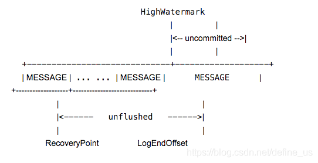

- [为何使用消息队列](#为何使用消息队列)
  - [异步](#异步)
  - [削峰](#削峰)
  - [解耦](#解耦)
- [主要问题](#主要问题)
  - [可用性](#可用性)
  - [重复消费](#重复消费)
  - [消息顺序](#消息顺序)
  - [数据丢失](#数据丢失)
    - [生产者丢失数据](#生产者丢失数据)
    - [消息队列自己丢失数据](#消息队列自己丢失数据)
    - [消费者丢失数据](#消费者丢失数据)
    - [kafka的解决方案](#kafka的解决方案)
  - [kafka文件存储机制](#kafka文件存储机制)
  - [kafka 配置topic](#kafka-配置topic)
  - [kafka checkpoint](#kafka-checkpoint)
    - [Log Start Offset](#log-start-offset)
    - [Recovery Point Offset](#recovery-point-offset)
    - [Replication Offset](#replication-offset)

# 为何使用消息队列

## 异步

用户响应时间随着链路越长变得越长 可以抽取部分流程异步完成 不使用线程池的原因是可以关注于自己开发的部分 更加易于维护

## 削峰

把请求放到队列中 慢慢处理

## 解耦

对于消息队列两端的代码可以解耦。

# 主要问题

## 可用性

一般的消息队列中间件都提供了高可用
比如kafka和RocketMQ
Producer与NameServer集群中的其中一个节点（随机选择）建立长连接，定期从NameServer获取Topic路由信息，并向提供Topic服务的Broker Master建立长连接，且定时向Master发送心跳。Producer只能将消息发送到Broker master。
Consumer则不一样，它同时与提供Topic服务的Master、Slave建立长连接，既可以从Master订阅消息，也可以从Slave订阅消息，订阅规则由Broker配置决定。

kafka 0.8以前，是没有HA机制的，就是任何一个broker宕机了，那个broker上的partition就废了，没法写也没法读，没有什么高可用性可言。

kafka 0.8以后，提供了HA机制，就是replica副本机制。每个partition的数据都会同步到其他机器上，形成自己的多个replica副本。然后所有replica会选举一个leader出来，那么生产和消费都跟这个leader打交道，然后其他replica就是follower。写的时候，leader会负责把数据同步到所有follower上去，读的时候就直接读leader上数据即可。只能读写leader？很简单，要是你可以随意读写每个follower，那么就要care数据一致性的问题，系统复杂度太高，很容易出问题。kafka会均匀的将一个partition的所有replica分布在不同的机器上，这样才可以提高容错性

Zookeeper的的作用与NameServer的作用相似， 用于保存集群配置、选举Leader等。
集群中有许多broker用于堆积消息，Kafka支持水平扩展，一般broker数量越多，集群吞吐率越高。
Producer使用push模式将消息发布到broker。
Consumer使用pull模式从broker订阅并消费消息

## 重复消费

现在消息队列一般都能保证at least once的，也就是消息至少一次投递。
在这种情况为什么会出现重复消费的问题呢？
通常都是由于网络原因造成的，原因如下：
通常消息被成功消费后消费者都会发送一个成功标志给MQ，MQ收到这个标志就表示消息已经成功消费了，就不会在发送给其他消费者了。
但是如果因为网络这个标志没有送到MQ就丢失了，MQ就认为这个消息没有被成功消费，就会再次发送给其他消费者消费，就造成了重复了。
防止重复消费其实是要保重消费的幂等性 可以通过插入之前先查询的方式/redis set天然幂等性等方式保证

## 消息顺序

因为一个topic可以有多个partition，kafka只能保证partition内部有序
partition数量=同一个消费者组中消费者数量时，可能需要顺序的数据分布到了不同的partition，导致处理时乱序

Kafka 中发送1条消息的时候，可以指定(topic, partition, key) 3个参数。partiton 和 key 是可选的。如果你指定了 partition，那就是所有消息发往同1个 partition，就是有序的。并且在消费端，Kafka 保证，1个 partition 只能被1个 consumer 消费。或者你指定 key（比如 order id），具有同1个 key 的所有消息，会发往同1个 partition。也是有序的。

## 数据丢失

### 生产者丢失数据

产生原因：
生产者发送了消息 但是没有到mq就丢失了(比如网络原因)
解决思路:
类似rabbitmq可以提供事务机制 类似分布式事务中的两阶段提交

### 消息队列自己丢失数据

产生原因：
没有消费的时候 消息队列自己挂掉了
解决方式：
消息持久化 持久化成功之后再通知生产者完成发送

### 消费者丢失数据

产生原因：
rabbitmq如果丢失了数据，主要是因为你消费的时候，刚消费到，还没处理，结果进程挂了，比如重启了，那么就尴尬了，rabbitmq认为你都消费了，这数据就丢了。
解决方式：
这个时候得用rabbitmq提供的ack机制，简单来说，就是你关闭rabbitmq自动ack，可以通过一个api来调用就行，然后每次你自己代码里确保处理完的时候，再程序里ack一把。这样的话，如果你还没处理完，不就没有ack？那rabbitmq就认为你还没处理完，这个时候rabbitmq会把这个消费分配给别的consumer去处理，消息是不会丢的。

### kafka的解决方案

kafka某个broker宕机 重新选举leader时其他follower刚好有数据未同步 会造成数据丢失。
可以设置几个参数防止此类情况
topic的replication factor 要求每个partition至少有几个副本
min.insync.replicas这个值要设置大于1 要求leader至少感知到至少有几个follower跟自己保持联系 确保leader挂了还有几个follower数据已经同步过
生产者端acks = all 要求每条数据必须写入所有的分片之后才能认为写成功了
生产者retries = MAX 写入失败无限重试

## kafka文件存储机制

生产者消费者发布和订阅的核心为topic
同一个topic下有多个不同的partition 每个partition可以理解为一个目录(文件夹) partition的命名规则为topic的名称加序号
每一个partition目录下的文件被分为大小相等的数据文件(默认为500M) 每一个数据文件称之为一个segment
其中每个partition中的segment file由log 和index一起构成
kafka是顺序写入数据 但是难以保证全局的消费有序的

## kafka 配置topic

```shell
./kafka-topics.sh --describe --zookeeper mogo-001.hadoop:2181,mogo-002.hadoop:2181,mogo-003.hadoop:2181 --topic elk_log_dev

./kafka-topics.sh --zookeeper mogo-001.hadoop:2181,mogo-002.hadoop:2181,mogo-003.hadoop:2181 --alter --topic elk_log_dev --config retention.ms=86400000 --config segment.ms=86400000
```

## kafka checkpoint

每个文件是一个segment。
在broker的log存储文件下，除了存储这各个topic的文件夹，还存在这几个checkpoint文件。分别是

`cleaner-offset-checkpoint` 记录清理者的offset

`log-start-offset-checkpoint` 记录log开始的offset

`recovery-point-offset-checkpoint` 负责记录topic已经被写入磁盘的offset。

`replication-offset-checkpoint` 用来存储每一个replica的HighWatermark。由ReplicaManager负责写。参考下面关于HW定义，也就是那些已经成功被复制给其他broker消息的offset

其中有些比较重要的offset点

`HighWatermark` 最后committed消息的起始偏移。它后面的消息在目前还是uncommited的状态。

`logStartOffset` 日志段集合中第一个日志段（segment）的基础位移，也就是这个日志对象的基础位移

`LogEndOffset` 下一条将要被加入到日志的消息的位移。注意，这个offset未必在硬盘中，可能目前只在内存中还没有被flush到硬盘。



“kafka会利用checkpoint机制对offset进行持久化” --- 这里的offset不是指消费者的消费位移，而是指其他位移，而持久化应该是指Kafka把位移数据保存到Broker本地磁盘文件这件事。目前，Kafka对三类位移做checkpointing：

### Log Start Offset

先说第一个。每个topic partition log对象都有一个重要的位移字段：log start offset，标识分区消息对外部用户或应用可见的最早消息位移。在一些事件发生时Kafka会触发对该值的更新。Kafka对该offset进行checkpointing的初衷是更快地保存分区的元数据，这样下次再初始化Log对象时能够直接加载并初始化log start offset。

### Recovery Point Offset

第二个是recovery point offset，它保存的是第一条未flush到磁盘的消息。Kafka对它进行checkpointing能够显著加速日志段恢复（recover）的速度，因为直接从recovery point offset所在的日志段开始恢复即可，没必要从头恢复日志段。毕竟生产环境上，分区下的日志段文件可能是非常多的。

### Replication Offset

第三个是replication offset，保存replication过程中副本的高水位（HW）位移值。通常的场景是当副本重启回来后创建Log对象时直接使用这个文件中的offset对高水位对象进行赋值，省去了读取日志段自行计算HW值的步骤。总之，checkpoint大体的作用都是将Kafka Broker端重要的日志元数据保存下来，避免后面“书到用时方恨少”的尴尬
