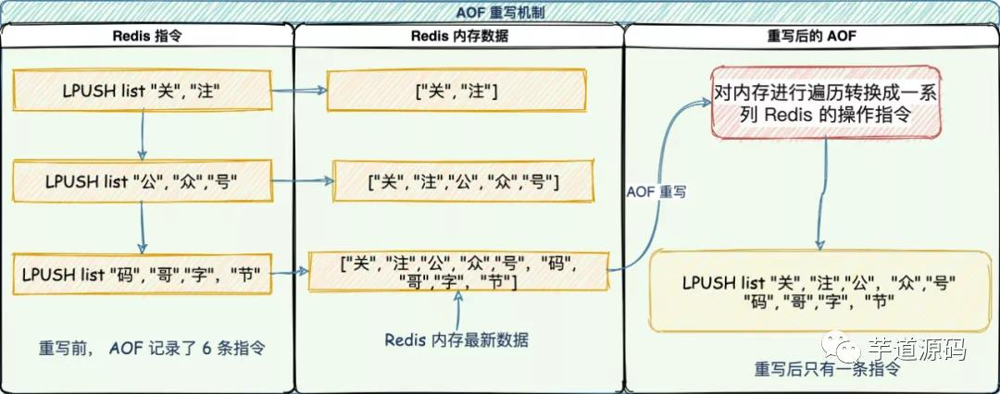
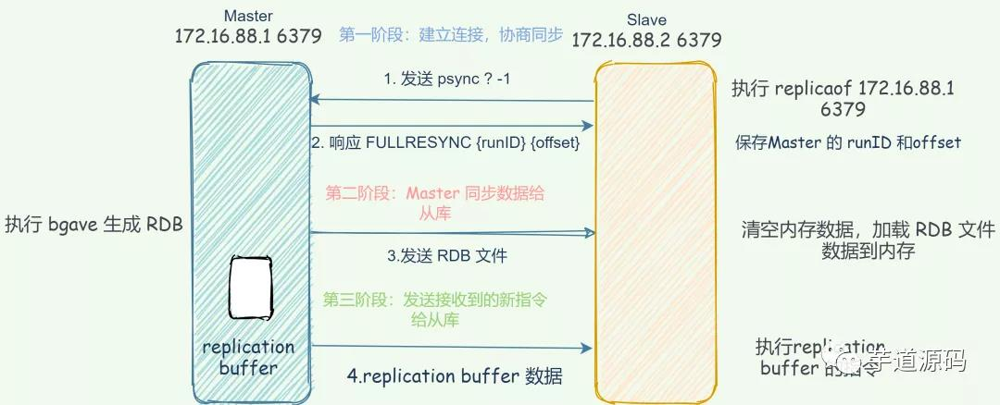
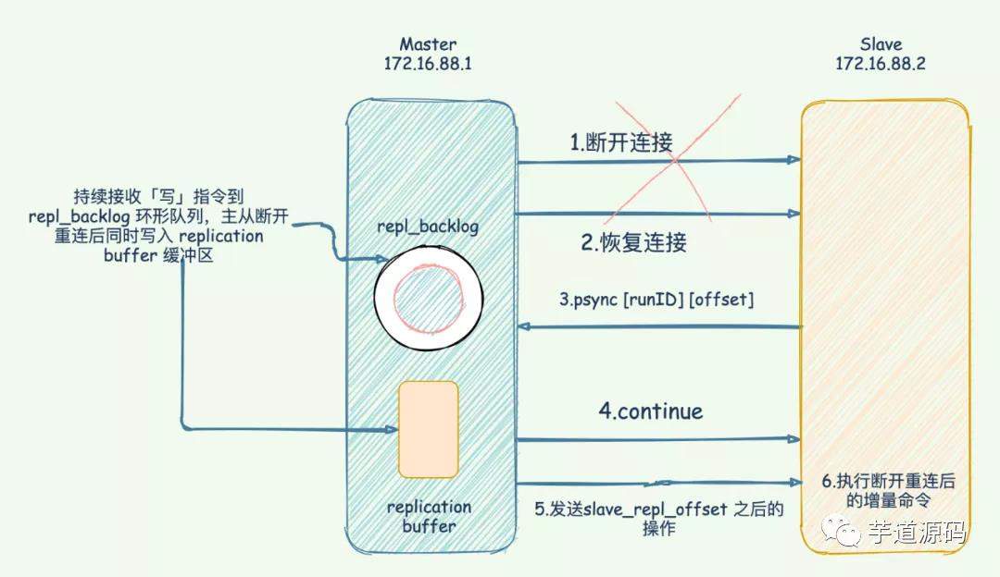
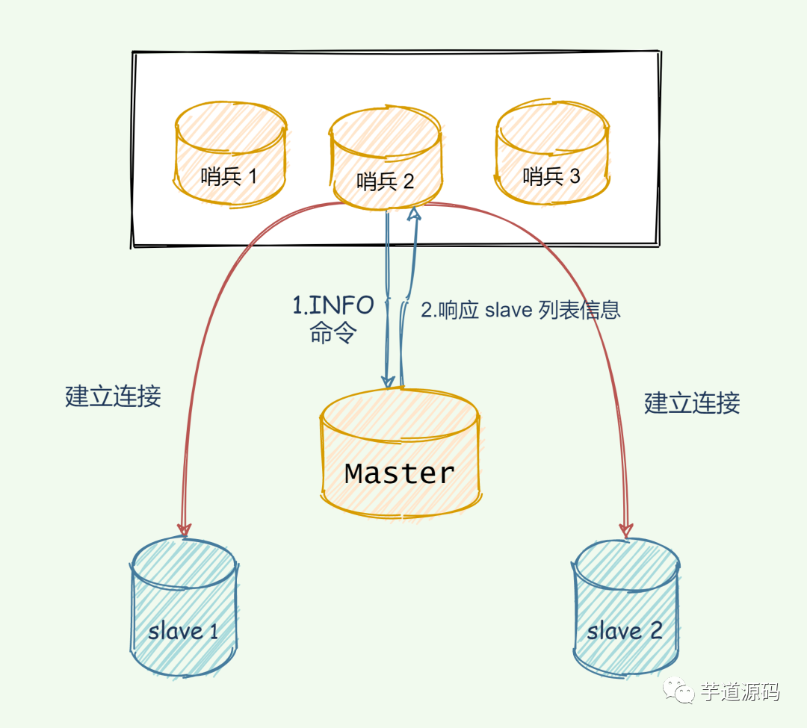
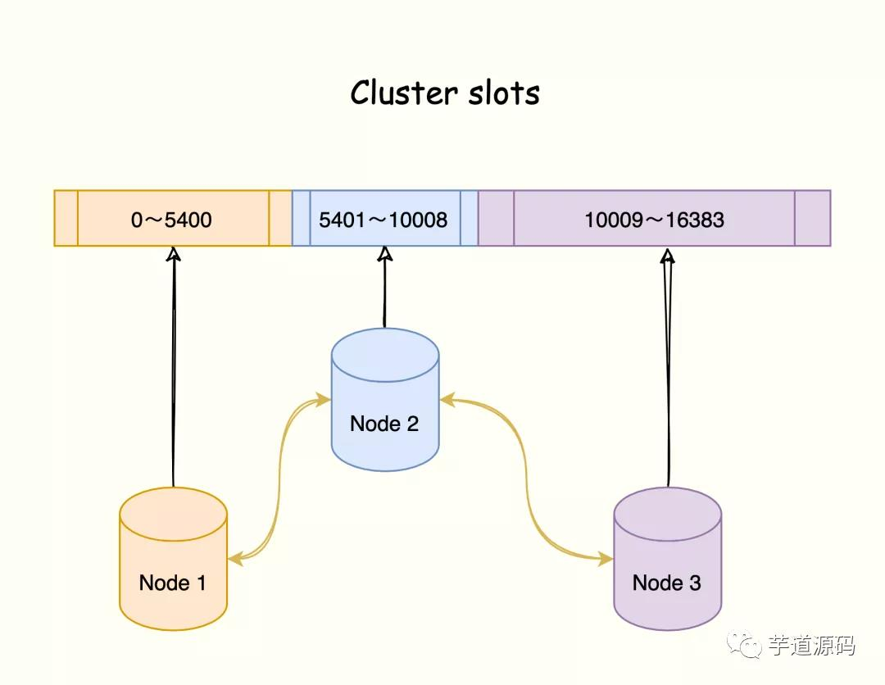
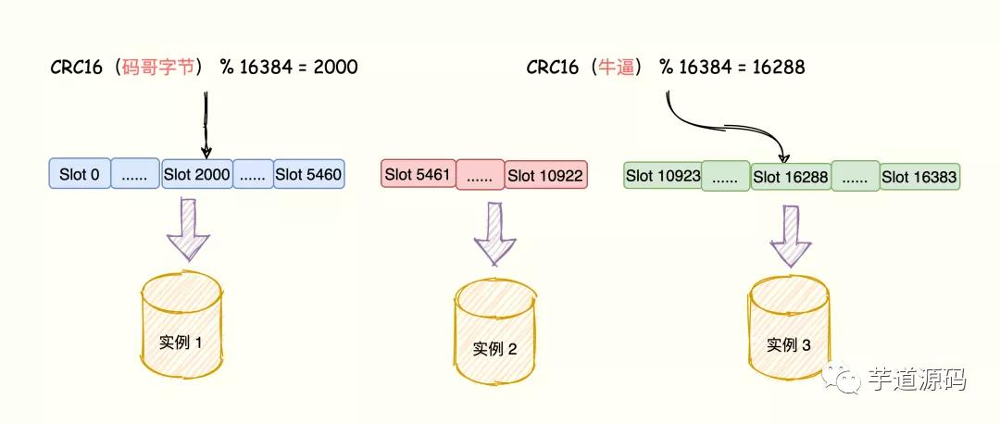
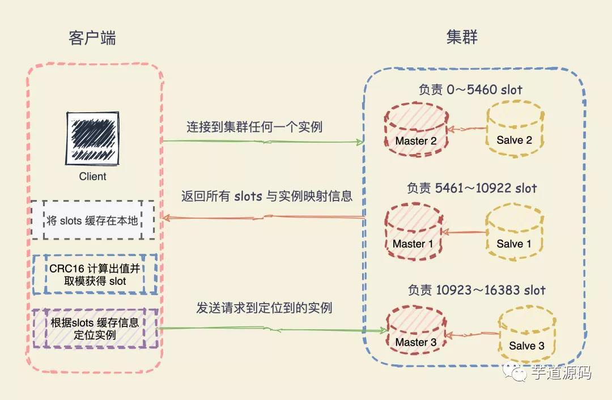

## Redis

### 1.为什么说Redis是单线程的？

Redis是基于Reactor模型设计的一套高效的文件事件处理模型，这套文件事件处理模型对应的就是Redis的文件事件处理器。因为文件事件处理器是以单线程方式运行的，所以说Redis是单线程


### 2.Redis6.0之前为什么使用单线程而不引用多线程？

单线程开发简单，已于维护

性能瓶颈不是在cpu，而是在内存和网络

引入多线程，会出现死锁、线程上下文切换等问题，而引起性能下降等问题

6.0之后引用是因为要提高网络io的读写性能。其实只有涉及到网络io读写的时候才使用多线程，内部原子指令的执行仍然是单线程。


### 3.Redis是如何判断数据是否过期的？

Redis有一个expire过期字典（类似于hashmap），key存的是指向具体某个键值的key的指针，value是设置的过期时间。精确到毫秒


### 4.Redis的内存淘汰机制

1. **volatile-lru（least recently used）**：从已设置过期时间的数据集（server.db[i].expires）中挑选最近最少使用的数据淘汰
2. **volatile-ttl**：从已设置过期时间的数据集（server.db[i].expires）中挑选将要过期的数据淘汰
3. **volatile-random**：从已设置过期时间的数据集（server.db[i].expires）中任意选择数据淘汰
4. **allkeys-lru（least recently used）**：当内存不足以容纳新写入数据时，在键空间中，移除最近最少使用的 key（这个是最常用的）
5. **allkeys-random**：从数据集（server.db[i].dict）中任意选择数据淘汰
6. **no-eviction**：禁止驱逐数据，也就是说当内存不足以容纳新写入数据时，新写入操作会报错。这个应该没人使用吧！


### 5.Redis的事务

Redis 可以通过 **`MULTI`，`EXEC`，`DISCARD` 和 `WATCH`** 等命令来实现事务(transaction)功能。

```
原子性（Atomicity）： 事务是最小的执行单位，不允许分割。事务的原子性确保动作要么全部完成，要么完全不起作用；
隔离性（Isolation）： 并发访问数据库时，一个用户的事务不被其他事务所干扰，各并发事务之间数据库是独立的；
持久性（Durability）： 一个事务被提交之后。它对数据库中数据的改变是持久的，即使数据库发生故障也不应该对其有任何影响。
一致性（Consistency）： 执行事务前后，数据保持一致，多个事务对同一个数据读取的结果是相同的；
```


Redis不支持回滚，所以事务不满足原子性和持久性

简单来说：**Redis的事务就是将多个命令打包，按照顺序执行所有命令，并且不允许中途打断。**

### 6.Redis宕机如何实现持久化？宕机后数据如何恢复？

有RDB数据快照和AOF两种方式

RDB：将某一时刻的数据以文件形式保存下来

过于频繁的执行全量数据快照会有两个性能问题：

（1）频繁的向磁盘中写入RDB文件，对磁盘的压力很大。可能上一个RDB文件还没生成，下一个RDB文件又开始了。造成了死循环

（2）fork出的bgsave子线程会阻塞主线程，主线程的内存越大，阻塞时间越长

AOF:主要记录修改指令

AOF 日志记录了自 Redis 实例创建以来所有的修改性指令序列，那么就可以通过对一个空的 Redis 实例顺序执行所有的指令，也就是「重放」，来恢复 Redis 当前实例的内存数据结构的状态。

Redis 提供的 AOF 配置项`appendfsync`写回策略直接决定 AOF 持久化功能的效率和安全性。

- **always** ：同步写回，写指令执行完毕立马将 `aof_buf`缓冲区中的内容刷写到 AOF 文件。
- **everysec** ：每秒写回，写指令执行完，日志只会写到 AOF 文件缓冲区，每隔一秒就把缓冲区内容同步到磁盘。
- **no：** 操作系统控制，写执行执行完毕，把日志写到 AOF 文件内存缓冲区，由操作系统决定何时刷写到磁盘。


AOF 写前日志，记录的是每个「写」指令操作。不会像 RDB 全量快照导致性能损耗，但是执行速度没有 RDB 快，同时日志文件过大也会造成性能问题。

所以，Redis 设计了一个杀手锏「AOF 重写机制」，Redis 提供了 `bgrewriteaof`指令用于对 AOF 日志进行瘦身。

其原理就是开辟一个子进程对内存进行遍历转换成一系列 Redis 的操作指令，序列化到一个新的 AOF 日志文件中。序列化完毕后再将操作期间发生的增量 AOF 日志追加到这个新的 AOF 日志文件中，追加完毕后就立即替代旧的 AOF 日志文件了，瘦身工作就完成了。




### 7.在生成RDB期间，Redis可以同时处理写请求么？

可以的，Redis 使用操作系统的多进程**写时复制技术 COW(Copy On Write)** 来实现快照持久化，保证数据一致性。

Redis 在持久化时会调用 glibc 的函数`fork`产生一个子进程，快照持久化完全交给子进程来处理，父进程继续处理客户端请求。

当主线程执行写指令修改数据的时候，这个数据就会复制一份副本， `bgsave` 子进程读取这个副本数据写到 RDB 文件。

这既保证了快照的完整性，也允许主线程同时对数据进行修改，避免了对正常业务的影响。


### 8.如何实现数据尽可能少丢失又能兼顾性能呢？

重启 Redis 时，我们很少使用 rdb 来恢复内存状态，因为会丢失大量数据。我们通常使用 AOF 日志重放，但是重放 AOF 日志性能相对 rdb 来说要慢很多，这样在 Redis 实例很大的情况下，启动需要花费很长的时间。

Redis 4.0 为了解决这个问题，带来了一个新的持久化选项——**混合持久化** 。将 rdb 文件的内容和增量的 AOF 日志文件存在一起。这里的 AOF 日志不再是全量的日志，而是**自持久化开始到持久化结束的这段时间发生的增量 AOF 日志** ，通常这部分 AOF 日志很小。

于是**在 Redis 重启的时候，可以先加载 rdb 的内容，然后再重放增量 AOF 日志就可以完全替代之前的 AOF 全量文件重放，重启效率因此大幅得到提升** 。


### 9.主从之间数据如何保证一致性？

为了保证副本数据的一致性，采用了读写分离的方式。

- 读操作：主、从都可以执行
- 写操作：主库先执行，之后再将写操作同步给从库


### 10.主从复制还有其他作用吗？是如何实现的？

作用：

1.故障恢复：主库宕机，从库仍然能提供服务

2.负载均衡：主库负责提供写服务，从库提供读服务。分担压力

5.高可用基石：哨兵和cluster实施的基础，是高可用的基石

同步分为三种情况：

1.第一次主从库全量同步

2.主从正常运行期间同步

3.主从断开重连同步


全量同步：

1. 建立连接：**从库会和主库建立连接，从库执行 replicaof 并发送 psync 命令并告诉主库即将进行同步，主库确认回复后，主从库间就开始同步了** 。
2. 主库同步数据给从库：master 执行 `bgsave`命令生成 RDB 文件，并将文件发送给从库，同时**主库** 为每一个 slave 开辟一块 replication buffer 缓冲区记录从生成 RDB 文件开始收到的所有写命令。从库保存 RDB 并清空数据库再加载 RDB 数据到内存中。
3. 发送 RDB 之后接收到的新写命令到从库：在生成 RDB 文件之后的写操作并没有记录到刚刚的 RDB 文件中，为了保证主从库数据的一致性，所以主库会在内存中使用一个叫 replication buffer 记录 RDB 文件生成后的所有写操作。并将里面的数据发送到 slave。



### 主从库间的网络断了咋办？断开后要重新全量复制么？

采用的**增量复制**

增量复制：**用于网络中断等情况后的复制，只将中断期间主节点执行的写命令发送给从节点，与全量复制相比更加高效** 。

`repl_backlog_buffer` 缓冲区：不管在什么时候 master 都会将写指令操作记录在 `repl_backlog_buffer` 中，因为内存有限， `repl_backlog_buffer` 是一个定长的环形数组，**如果数组内容满了，就会从头开始覆盖前面的内容** 。

master 使用 `master_repl_offset`记录自己写到的位置偏移量，slave 则使用 `slave_repl_offset`记录已经读取到的偏移量。




### 完成全量同步后，正常运行过程中如何同步数据呢？

当主从库完成了全量复制，它们之间就会一直维护一个网络连接，主库会通过这个连接将后续陆续收到的命令操作再同步给从库，这个过程也称为基于长连接的命令传播，使用长连接的目的就是避免频繁建立连接导致的开销。

### 11.哨兵集群原理

哨兵模式主要是**对Redis实例（主、从节点）运行状态的监控，并能够在主节点发生故障时通过一系列的机制进行选主及主从切换，实现故障转移。确保整个Redis的可用性。‘**

Redis哨兵具体的功能：

- 监控：持续监控master、slave是否处于预期工作状态
- 自动切换主库：当master运行故障，哨兵启动自动故障恢复流程：从slave中选取一台作为master
- 通知：slave执行replicaof命令，和新的master进行同步；通知客户端和新的master建立连接


哨兵之间是如何知道彼此的？

哨兵与 master 建立通信，利用 master 提供发布/订阅机制发布自己的信息，比如身高体重、是否单身、IP、端口……

master 有一个 `__sentinel__:hello` 的专用通道，用于哨兵之间发布和订阅消息。**这就好比是 `__sentinel__:hello` 微信群，哨兵利用 master 建立的微信群发布自己的消息，同时关注其他哨兵发布的消息** 。

哨兵是如何监控slave的？

利用 master 来实现，哨兵向 master 发送 `INFO` 命令， master 掌门自然是知道自己门下所有的 salve 小弟的。所以 master 接收到命令后，便将 slave 列表告诉哨兵。

哨兵根据 master 响应的 slave 名单信息与每一个 salve 建立连接，并且根据这个连接持续监控哨兵。




### 12.除了哨兵以外，还有其他的高可用手段么？

哨兵集群监控的Redis集群是主从架构，无法横向扩展。**使用Redis Cluster集群，主要解决了大数据量存储导致的各种满问题，同时也便于横向扩展。**

在面向百万、千万级别的数据量时，横向扩展的Redis切片集群会是一个非常好的选择。


### 13.什么是Cluster集群？

Redis Cluster集群是一个分布式数据库方案，集群通过数据分片来进行管理（“分而治之”）并提供复制和故障转移的功能。

将数据划分为16384个slots。每个节点负责一部分槽位。槽位的信息存储于每个节点中。

它是去中心化的。如图所示，该集群由三个 Redis 节点组成，每个节点负责整个集群的一部分数据，每个节点负责的数据多少可能不一样。



三个节点相互连接组成一个对等的集群，它们之间通过 `Gossip`协议相互交互集群信息，最后每个节点都保存着其他节点的 slots 分配情况。


### 14.哈希槽是如何映射到Redis实例上的？

1. 根据键值对的 key，使用 CRC16 算法，计算出一个 16 bit 的值；
2. 将 16 bit 的值对 16384 执行取模，得到 0 ～ 16383 的数表示 key 对应的哈希槽。
3. 根据该槽信息定位到对应的实例。

键值对数据、哈希槽、Redis 实例之间的映射关系如下：





### 15.Cluster如何实现故障转移？

Redis 集群节点采用 `Gossip` 协议来广播自己的状态以及自己对整个集群认知的改变。比如一个节点发现某个节点失联了 (PFail)，它会将这条信息向整个集群广播，其它节点也就可以收到这点失联信息。

如果一个节点收到了某个节点失联的数量 (PFail Count) 已经达到了集群的大多数，就可以标记该节点为确定下线状态 (Fail)，然后向整个集群广播，强迫其它节点也接收该节点已经下线的事实，并立即对该失联节点进行主从切换。

### 16.客户端怎么确定访问的数据分布在哪个实例上呢？

Redis 实例会将自己的哈希槽信息通过 Gossip 协议发送给集群中其他的实例，实现了哈希槽分配信息的扩散。

这样，集群中的每个实例都有所有哈希槽与实例之间的映射关系信息。

当客户端连接任何一个实例，实例就将哈希槽与实例的映射关系响应给客户端，客户端就会将哈希槽与实例映射信息缓存在本地。

当客户端请求时，会计算出键所对应的哈希槽，再通过本地缓存的哈希槽实例映射信息定位到数据所在实例上，再将请求发送给对应的实例。




### 17.什么是 Redis 重定向机制？

哈希槽与实例之间的映射关系由于新增实例或者负载均衡重新分配导致改变了，**客户端将请求发送到实例上，这个实例没有相应的数据，该 Redis 实例会告诉客户端将请求发送到其他的实例上** 。

Redis 通过 MOVED 错误和 ASK 错误告诉客户端。