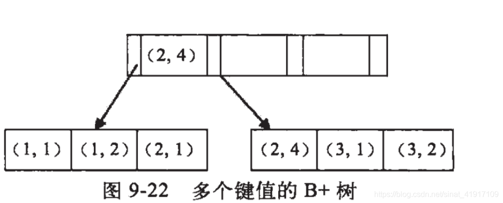

### 1.mysql的索引结构 默认大小为16k 三层大概可以存储多少数据？

  区别 linux 页大小默认为4k

  磁盘块大小默认为4k 磁盘预读缓冲行为按页读取

  即磁盘和内存进行数据交换的时候是以页为单位 比如innodb默认为16k = 4个磁盘块/4kb

  **B+树 的一个节点大小=innodb的一页=4个操作系统页(一页4kb)=16kb**

 粗略计算如下：

  叶子节点存的是一行记录：

​		假如一行数据的大小为1kb（单条记录可以存储成千上万个字符）

  叶子节点可以存放的数据：16k/1k=16条数据

   	非叶子结点（索引+指针） ：假设索引id为long型（8b）+指针 （6b）=14b

   非叶子节点可以存放：16*1024/14 = 1170

   假设b+树为2层：那么一个根节点指向1170个叶子节点 总数据为 1170*16

   假设b+树为3层：第二层的1170个节点 每个节点都会指向第三层的1170个叶子节点

   总数据为1170X1170X16 = 21902400 大约是两千多万条数据


### 2.mysql大数据量的分页优化

```sql
 select * from test limit 1000000,100 (100*pageNum)
 通过主键索引加快查询效率
   （1）id 连续 
   select * from test where id > 1000000 limit 100
    (2)id 不连续 且 自增
    使用之前记录上一页最大offset
   （3）id 不连续且自增，利用子查询 
   通过建立临时表（id为自增序列 test_id 对应 test中的id）
   select * from test where id in (select temp_id from test_temp where id > 1000000 order by id) limit 100
   --不要使用between and 不然会走全表扫描
   select * from test where id between 10000000 and 1000100 limit 100
   不会走索引直接是全表扫描
```

### 3.组合索引 是否会失效的问题

```sql
b+树构建是通过一个值，如果是联合索引是键值对。所以数据库采用最左的字段来构建b+树
假设联合索引(a,b)
```





可以看到a的值是有顺序的，1，1，2，2，3，3，而b的值是没有顺序的1，2，1，4，1，2。所以b = 2这种查询条件没有办法利用索引，因为联合索引首先是按a排序的，b是无序的。

同时我们还可以发现在a值相等的情况下，b值又是按顺序排列的，但是这种顺序是相对的。所以最左匹配原则遇上范围查询就会停止，剩下的字段都无法使用索引。例如a = 1 and b = 2 a,b字段都可以使用索引，因为在a值确定的情况下b是相对有序的，而a>1and b=2，a字段可以匹配上索引，但b值不可以，因为a的值是一个范围，在这个范围中b是无序的。

**最左匹配原则：**最左优先，以最左边的为起点任何连续的索引都能匹配上。同时遇到范围查询(>、<、between、like)就会停止匹配

假设建立联合索引（a,b,c）

```sql
1.全值匹配查询
select * from table_name where b = '2' and a = '1' and c = '3' 
select * from table_name where c = '3' and b = '2' and a = '1'
--用到了索引 mysql有优化器会自动对查询顺序进行优化

2.匹配左边的列时
select * from table_name where a = '1'
select * from table_name where b = '2' and a = '1'
--从最左边开始连续匹配用到了索引
select * from table_name where b = '2' and c = '1'
--没有从最左边开始所以没有用到索引,用的是全表扫描
select * from table_name where a = '2' and c = '1'
--不连续时只有a用到了索引c没有

3.匹配列前缀
select * from table_name where a like 'As%'; //前缀都是排好序的，走联合索引查询
select * from table_name where a like '%As'//全表查询
select * from table_name where a like '%As%'//全表查询
--如果a是字符类型，那么前缀匹配用的是索引 后缀和中缀只能全表扫描

4.匹配范围值
select * from temp where  a > 1 and a < 3
--可以对最左边的列进行范围查询
select * from temp where  a > 1 and a < 3 and b > 2
--多个列同时进行范围只会对索引最左边的那个列进行范围查找用到b+树索引
--只有a会用到索引
--在1<a<3的范围内b是无序的，不能用索引，找到1<a<3的记录后，只能根据条件 b > 1继续逐条过滤

5.精确匹配某一列并范围匹配另外一列
select * from table_name where  a = 1 and b > 3;
select * from table_name where  a = 1 and c > 3;
--左边是精确查找右边可以进行范围查找使用的是联合索引

6.排序
Mysql中把这种在内存中或磁盘上进行排序的方式统称为文件排序。文件排序非常慢，但如果order子句用到了索引列，就有可能省去文件排序的步骤
select * from table_name order by a,b,c limit 10
select * from table_name order by c,b,a limit 10

select * from table_name order by a limit 10;
select * from table_name order by a,b limit 10;
select * from table_name order by a,b limit 10;
select * from table_name where a = 1 order by c,b limit 10;
--联合索引左边列为常量，后边的列排序可以用到联合索引 
```

### 4.sql优化经验


### 5.页分裂和页合并


### 6.为什么mysql中主键一般是数值类型而不建议使用字符串类型

如果是数值类型利用b+树叶子节点有序的特性进行查询操作时是顺序io效率比较高

如果是字符串类型比如uuid 一个是占用的空间比较大 

另一个问题是字符串没有规律,插入新的数据有时候需要开辟新的页,大量的数据需要移动,造成了大量的随机io耗费性能（数据分散在不同的扇区中需要磁臂移动到指定的扇区才能获取到数据）

### 7.为什么要建立索引？为什么不对表中的每一个列创建一个索引呢？建立索引有哪些条件？

建立索引可以提高系统的查询性能

优点：

1.通过创建唯一性索引 可以保证数据库表中每一行数据的唯一性

2.可以大大加快数据的检索速度

3.在使用分组和排序进行数据检索时 同样可以显著减少查询中分组和排序的时间

为什么不建议一个表中建立多个索引：

第一，创建索引和维护索引要耗费时间，这种时间随着数据 量的增加而增加。

第二，索引需要占物理空间，除了数据表占数据空间之外，每一个索引还要占一定的物理空间，如果要建立聚簇索引，那么需要的空间就会更大。

第三，当对表中的数据进行增加、删除和修改的时候，索引也要动态的维护，这样就降低了数据的维护速度。

哪些列可以建立索引：

在经常需要搜索的列上，可以加快搜索的速度；

在作为主键的列上，强制该列的唯一性和组织表中数据的排列结构；

在经常用在连接的列上，这 些列主要是一些外键，可以加快连接的速度；

在经常需要根据范围进行搜索的列上创建索引，因为索引已经排序，其指定的范围是连续的；

在经常需要排序的列上创 建索引，因为索引已经排序，这样查询可以利用索引的排序，加快排序查询时间；

在经常使用在WHERE子句中的列上面创建索引，加快条件的判断速度。

那些列不应该经常建立索引：

经常修改的列

数据类型为text、image和bit类型的

列的数据离散性不好重复数据太多


### 8.order by的排序

有两种方式：

（1）基于内存和磁盘的文件排序

（2）根据索引顺序排序

文件排序（FileSort）会出现的情况：

```sql
1. order by 字段 不是索引字段
2. order by是索引字段 但是查询列中没有覆盖索引
   explain select * from temp order by a ,b 
3. order by中同时出现asc 和desc 
   explain select b,a from temp order by a desc ,b asc
4. order by多个字段排序 不是按照索引顺序进行order by
   explain select b,a from temp order by a ,b 

单路排序：一次性取出所有满足条件行的字段在sort buffer（排序缓存）中进行排序
双路排序：将id和排序的字段放在sort buffer中进行排序，根据主键再进行回表查询数据
对比：单路排序会更快效率更高，不用二次读取数据，把随机io变成顺序io，但是会使用更多的空间
```

